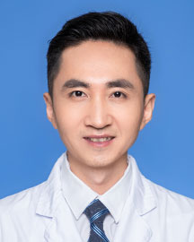

<!-- AUTO-GENERATED-BY: work/generate_obsidian_profiles.py -->

<!-- TEMPLATE: D:\workspace\信息收集整理\医生画像仓库\模板\医生画像模板.md -->

# 李凯

## 基础信息

| 字段 | 内容 |
|---|---|
| 姓名 | 李凯 |
| 医院 | 广东省人民医院 |
| 科室 | 乳腺科 |
| 职称/身份 | 主治医师 |
| 来源链接 | [官网原文](https://www.gdghospital.org.cn/Expertlistt/info_itemid_32874_subjectid_29.html) |
| 采集日期 | 2026-08-14 |

## 简介/擅长

早期乳腺癌的诊治，乳腺癌新辅助治疗等，可进行乳腺微创、保乳及改良等手术

## 科研项目与成果

- 于2017/03/14-2017/03/30由廖宁主任推荐获得国际外科肿瘤学会（SSO）grant, 作为SSO国际职业发展交换项目的一员有机会MD.Anderson, Emory University Hospital等国际知名肿瘤中心学习。

## 论文与学术产出

- 发表多篇SCI论文。

## 可包装亮点

- 肿瘤学博士 主要社会兼职 中华医学会肿瘤学分会青委会 委员 长江学术带乳腺联盟（YBCSG）委员 广东省药学会乳腺用药专家委员会 委员 广州抗癌协会乳腺癌专业委员会 委员 广州抗癌协会分子生物学专业委员会 委员 教育经历和专业特长 攻读博士期间，师从复旦大学附属肿瘤医院邵志敏教授，主要从事早期乳腺癌诊治，乳腺癌的复发转移及遗传易感性方面的研究。
- 于2017/03/14-2017/03/30由廖宁主任推荐获得国际外科肿瘤学会（SSO）grant, 作为SSO国际职业发展交换项目的一员有机会MD.Anderson, Emory University Hospital等国际知名肿瘤中心学习。
- 发表多篇SCI论文。

## 重点疾病/人群标签

- 慢性病：
- 肿瘤：肿瘤、癌、乳腺癌
- 生殖疾病：
- 免疫/风湿：
- 术后恢复/康复：
- 疑难重症：

## 证据摘录

> 只摘录官网公开信息中的短句或关键字段，不复制大段原文。

- 官网身份字段：主治医师
- 官网简介/擅长：早期乳腺癌的诊治，乳腺癌新辅助治疗等，可进行乳腺微创、保乳及改良等手术
- 官网亮眼经历线索：肿瘤学博士 主要社会兼职 中华医学会肿瘤学分会青委会 委员 长江学术带乳腺联盟（YBCSG）委员 广东省药学会乳腺用药专家委员会 委员 广州抗癌协会乳腺癌专业委员会 委员 广州抗癌协会分子生物学专业委员会 委员 教育经历和专业特长 攻读博士期间，师从复旦大学附属肿瘤医院邵志敏教授，主要从事早期乳腺癌诊治，乳腺癌的复发转移及遗传易感性方面的研究。 于2017/03/14-2017/03/30由廖宁主任推荐获得国际外科肿瘤学会（SSO）g…
- 来源链接：https://www.gdghospital.org.cn/Expertlistt/info_itemid_32874_subjectid_29.html

## BD 画像摘要

李凯医生可作为肿瘤方向的基础画像候选。后续 BD 使用应继续以官网来源和人工复核为准，不添加疗效承诺或无来源包装。

## 合规边界

- 仅使用医院官网、官方公众号、官方小程序等公开渠道。
- 不采集私人电话、私人微信、家庭住址、患者隐私或非公开排班信息。
- 不写“保证治愈”“疗效第一”“包治疑难杂症”等无法由官网证明的表述。
