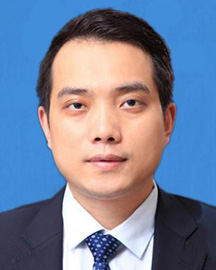

<!-- AUTO-GENERATED-BY: work/generate_obsidian_profiles.py -->

<!-- TEMPLATE: D:\workspace\信息收集整理\医生画像仓库\模板\医生画像模板.md -->

# 李勇

## 基础信息

| 字段 | 内容 |
|---|---|
| 姓名 | 李勇 |
| 医院 | 广东省人民医院 |
| 科室 | 胃肠外科 |
| 职称/身份 | 主任医师 副院长 |
| 来源链接 | [官网原文](https://www.gdghospital.org.cn/Expertlistt/info_itemid_24155_subjectid_104.html) |
| 采集日期 | 2026-08-14 |

## 简介/擅长

胃肠肿瘤规范化治疗、胃肠肿瘤术后快速康复治疗（ERAS）、腹腔镜微创手术治疗、营养支持治疗

## 教育与进修经历

- 中共党员 广东省人民医院副院长，兼任广东省人民医院赣州医院（赣州市立医院）院长 肿瘤学博士，主任医师，博士生导师，博士后合作导师 广东省杰出青年医学人才，广东青年五四奖章获得者 主要社会兼职 ： 中华医学会中华消化外科教育学院华南分院院长 中国医师协会微无创结直肠专业委员会副主任委员 中国医师协会肿瘤外科分会青委会副主任委员 中国抗癌协会肿瘤胃肠病分会副主任委员 广东省医师协会减重与代谢病工作委员会主任委员 广东省抗癌协会胃癌青年委员会主任委员 广东省医学会胃肠肿瘤学分会副主任委员 广东省药学会医药创新与转化专家…

## 科研项目与成果

- 学术专业领域成就 ： 主持省市级科研项目10项，参与多项胃癌、结直肠癌的国家级和省级研究课题。
- 以第一/通讯作者在国内外核心期刊发表多篇论文60余篇，其中SCI文章20余篇，获得实用新型专利4项，主编专著有《腹腔镜胃肠手术笔记》《胃肠外科加速康复实战笔记》《Notes on Laparoscopic Gastrointestinal Surgery》，担任《Gastrointestinal Stromal Tumor》杂志主编。

## 论文与学术产出

- 以第一/通讯作者在国内外核心期刊发表多篇论文60余篇，其中SCI文章20余篇，获得实用新型专利4项，主编专著有《腹腔镜胃肠手术笔记》《胃肠外科加速康复实战笔记》《Notes on Laparoscopic Gastrointestinal Surgery》，担任《Gastrointestinal Stromal Tumor》杂志主编。

## 可包装亮点

- 中共党员 广东省人民医院副院长，兼任广东省人民医院赣州医院（赣州市立医院）院长 肿瘤学博士，主任医师，博士生导师，博士后合作导师 广东省杰出青年医学人才，广东青年五四奖章获得者 主要社会兼职 ： 中华医学会中华消化外科教育学院华南分院院长 中国医师协会微无创结直肠专业委员会副主任委员 中国医师协会肿瘤外科分会青委会副主任委员 中国抗癌协会肿瘤胃肠病分会副主…
- 以第一/通讯作者在国内外核心期刊发表多篇论文60余篇，其中SCI文章20余篇，获得实用新型专利4项，主编专...

## 重点疾病/人群标签

- 慢性病：代谢、肿瘤、癌、胃癌、肠癌、术后、康复、营养
- 肿瘤：代谢、肿瘤、癌、胃癌、肠癌、术后、康复、营养
- 生殖疾病：
- 免疫/风湿：
- 术后恢复/康复：代谢、肿瘤、癌、胃癌、肠癌、术后、康复、营养
- 疑难重症：

## 证据摘录

> 只摘录官网公开信息中的短句或关键字段，不复制大段原文。

- 官网身份字段：主任医师 副院长
- 官网简介/擅长：胃肠肿瘤规范化治疗、胃肠肿瘤术后快速康复治疗（ERAS）、腹腔镜微创手术治疗、营养支持治疗
- 官网亮眼经历线索：中共党员 广东省人民医院副院长，兼任广东省人民医院赣州医院（赣州市立医院）院长 肿瘤学博士，主任医师，博士生导师，博士后合作导师 广东省杰出青年医学人才，广东青年五四奖章获得者 主要社会兼职 ： 中华医学会中华消化外科教育学院华南分院院长 中国医师协会微无创结直肠专业委员会副主任委员 中国医师协会肿瘤外科分会青委会副主任委员 中国抗癌协会肿瘤胃肠病分会副主任委员 广东省医师协会减重与代谢病工作委员会主任委员 广东省抗癌协会胃癌青年委员…
- 来源链接：https://www.gdghospital.org.cn/Expertlistt/info_itemid_24155_subjectid_104.html

## BD 画像摘要

李勇医生可作为慢性病、肿瘤、术后恢复/康复方向的基础画像候选。后续 BD 使用应继续以官网来源和人工复核为准，不添加疗效承诺或无来源包装。

## 合规边界

- 仅使用医院官网、官方公众号、官方小程序等公开渠道。
- 不采集私人电话、私人微信、家庭住址、患者隐私或非公开排班信息。
- 不写“保证治愈”“疗效第一”“包治疑难杂症”等无法由官网证明的表述。
