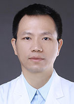

<!-- AUTO-GENERATED-BY: work/generate_obsidian_profiles.py -->

<!-- TEMPLATE: D:\workspace\信息收集整理\医生画像仓库\模板\医生画像模板.md -->

# 李学瑞

## 基础信息

| 字段 | 内容 |
|---|---|
| 姓名 | 李学瑞 |
| 医院 | 广东省人民医院 |
| 科室 | 乳腺科 |
| 职称/身份 | 主任医师 |
| 来源链接 | [官网原文](https://www.gdghospital.org.cn/Expertlistt/info_itemid_25359_subjectid_29.html) |
| 采集日期 | 2026-08-14 |

## 简介/擅长

乳腺癌微创外科保乳及术中放疗、乳房重建为主的综合治疗

## 教育与进修经历

- 共产党员，医学博士，乳腺科行政副主任 2018年第四届“羊城好医生” 广东省保健协会乳腺保健分会副主任委员 广州市医学会乳腺病学分会常委兼青年委员会主任委员 广东省医学会乳腺病分会常务委员 广东省胸部肿瘤协会乳腺癌专业委员会常务委员 广东省中医药学会乳腺病专业委员会常务委员 广东省抗癌协会乳腺癌专业委员会委员 广州市抗癌协会执行委员会委员 2014年—2016年德国海德堡大学曼海姆医学院学习乳腺癌术中放疗技术并获医学博士学位，擅长乳腺癌微创外科保乳及术中放疗、乳房重建为主的综合治疗。

## 可包装亮点

- 共产党员，医学博士，乳腺科行政副主任 2018年第四届“羊城好医生” 广东省保健协会乳腺保健分会副主任委员 广州市医学会乳腺病学分会常委兼青年委员会主任委员 广东省医学会乳腺病分会常务委员 广东省胸部肿瘤协会乳腺癌专业委员会常务委员 广东省中医药学会乳腺病专业委员会常务委员 广东省抗癌协会乳腺癌专业委员会委员 广州市抗癌协会执行委员会委员 2014年—20…

## 重点疾病/人群标签

- 慢性病：
- 肿瘤：肿瘤、癌、放疗、乳腺癌
- 生殖疾病：
- 免疫/风湿：
- 术后恢复/康复：
- 疑难重症：

## 证据摘录

> 只摘录官网公开信息中的短句或关键字段，不复制大段原文。

- 官网身份字段：主任医师
- 官网简介/擅长：乳腺癌微创外科保乳及术中放疗、乳房重建为主的综合治疗
- 官网亮眼经历线索：共产党员，医学博士，乳腺科行政副主任 2018年第四届“羊城好医生” 广东省保健协会乳腺保健分会副主任委员 广州市医学会乳腺病学分会常委兼青年委员会主任委员 广东省医学会乳腺病分会常务委员 广东省胸部肿瘤协会乳腺癌专业委员会常务委员 广东省中医药学会乳腺病专业委员会常务委员 广东省抗癌协会乳腺癌专业委员会委员 广州市抗癌协会执行委员会委员 2014年—2016年德国海德堡大学曼海姆医学院学习乳腺癌术中放疗技术并获医学博士学位，擅长乳腺…
- 来源链接：https://www.gdghospital.org.cn/Expertlistt/info_itemid_25359_subjectid_29.html

## BD 画像摘要

李学瑞医生可作为肿瘤方向的基础画像候选。后续 BD 使用应继续以官网来源和人工复核为准，不添加疗效承诺或无来源包装。

## 合规边界

- 仅使用医院官网、官方公众号、官方小程序等公开渠道。
- 不采集私人电话、私人微信、家庭住址、患者隐私或非公开排班信息。
- 不写“保证治愈”“疗效第一”“包治疑难杂症”等无法由官网证明的表述。
