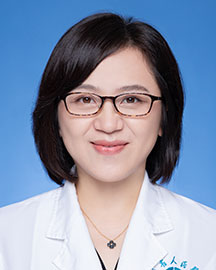

<!-- AUTO-GENERATED-BY: work/generate_obsidian_profiles.py -->

<!-- TEMPLATE: D:\workspace\信息收集整理\医生画像仓库\模板\医生画像模板.md -->

# 李志莲

## 基础信息

| 字段 | 内容 |
|---|---|
| 姓名 | 李志莲 |
| 医院 | 广东省人民医院 |
| 科室 | 肾内科 |
| 职称/身份 | 主任医师 |
| 来源链接 | [官网原文](https://www.gdghospital.org.cn/Expertlistt/info_itemid_24645_subjectid_15.html) |
| 采集日期 | 2026-08-14 |

## 简介/擅长

从事肾脏病专业20年，擅长各种原发性、继发性肾脏疾病、急慢性肾衰竭、血液透析心血管并发症的治疗，在IgA肾病、膜性肾病、狼疮性肾炎、糖尿病肾病方面有丰富的临床经验

## 教育与进修经历

- 医生简介 主任医师，医学博士，硕士研究生导师，广东省杰出青年医学人才，第九批“组团式”援藏工作组专家，美国Vanderbilt University肾内科访问学者，第八届“羊城好医生”，第二届广东医院最强科室-实力中青年医生。

## 可包装亮点

- 医生简介 主任医师，医学博士，硕士研究生导师，广东省杰出青年医学人才，第九批“组团式”援藏工作组专家，美国Vanderbilt University肾内科访问学者，第八届“羊城好医生”，第二届广东医院最强科室-实力中青年医生。
- 中国研究型医院学会肾脏病学专业委员会-委员，广东省女医师协会肾脏病分会-副主任委员，广东省医师协会肾脏内科医师分会青年医师专家组-副组长。

## 重点疾病/人群标签

- 慢性病：糖尿病、慢性
- 肿瘤：
- 生殖疾病：
- 免疫/风湿：
- 术后恢复/康复：
- 疑难重症：

## 证据摘录

> 只摘录官网公开信息中的短句或关键字段，不复制大段原文。

- 官网身份字段：主任医师
- 官网简介/擅长：从事肾脏病专业20年，擅长各种原发性、继发性肾脏疾病、急慢性肾衰竭、血液透析心血管并发症的治疗，在IgA肾病、膜性肾病、狼疮性肾炎、糖尿病肾病方面有丰富的临床经验
- 官网亮眼经历线索：医生简介 主任医师，医学博士，硕士研究生导师，广东省杰出青年医学人才，第九批“组团式”援藏工作组专家，美国Vanderbilt University肾内科访问学者，第八届“羊城好医生”，第二届广东医院最强科室-实力中青年医生。 中国研究型医院学会肾脏病学专业委员会-委员，广东省女医师协会肾脏病分会-副主任委员，广东省医师协会肾脏内科医师分会青年医师专家组-副组长。
- 来源链接：https://www.gdghospital.org.cn/Expertlistt/info_itemid_24645_subjectid_15.html

## BD 画像摘要

李志莲医生可作为慢性病方向的基础画像候选。后续 BD 使用应继续以官网来源和人工复核为准，不添加疗效承诺或无来源包装。

## 合规边界

- 仅使用医院官网、官方公众号、官方小程序等公开渠道。
- 不采集私人电话、私人微信、家庭住址、患者隐私或非公开排班信息。
- 不写“保证治愈”“疗效第一”“包治疑难杂症”等无法由官网证明的表述。
