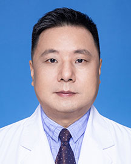

<!-- AUTO-GENERATED-BY: work/generate_obsidian_profiles.py -->

<!-- TEMPLATE: D:\workspace\信息收集整理\医生画像仓库\模板\医生画像模板.md -->

# 李忠文

## 基础信息

| 字段 | 内容 |
|---|---|
| 姓名 | 李忠文 |
| 医院 | 广东省人民医院 |
| 科室 | 内分泌科 |
| 职称/身份 | 副主任医师 |
| 来源链接 | [官网原文](https://www.gdghospital.org.cn/Expertlistt/info_itemid_23262_subjectid_20.html) |
| 采集日期 | 2026-08-14 |

## 简介/擅长

## 教育与进修经历

- 2018-2019年公派留学访问，在美国国立卫生研究院（NIH）做访问学者；

## 科研项目与成果

- 从业以来在广东省人民医院主持和参与多项卫生部、广东省科技厅、广东省中医药局及卫生厅医学课题组。

## 论文与学术产出

- 并于医学核心杂志发表相关医学论文三十余篇。

## 可包装亮点

- 广东省健康管理委员会内分泌常委，广东省中西医结合创面处理专业委员会委员， 广东省行业协会伤口管理分会常委；
- 广东省行业协会糖尿病分会委员；
- 广东省行业协会睡眠分会委员。
- 2018-2019年公派留学访问，在美国国立卫生研究院（NIH）做访问学者；

## 重点疾病/人群标签

- 慢性病：糖尿病、高脂血症、代谢、创面、伤口
- 肿瘤：
- 生殖疾病：
- 免疫/风湿：
- 术后恢复/康复：糖尿病、高脂血症、代谢、创面、伤口
- 疑难重症：

## 证据摘录

> 只摘录官网公开信息中的短句或关键字段，不复制大段原文。

- 官网身份字段：副主任医师
- 官网亮眼经历线索：广东省健康管理委员会内分泌常委，广东省中西医结合创面处理专业委员会委员， 广东省行业协会伤口管理分会常委； 广东省行业协会糖尿病分会委员； 广东省行业协会睡眠分会委员。 2018-2019年公派留学访问，在美国国立卫生研究院（NIH）做访问学者；
- 来源链接：https://www.gdghospital.org.cn/Expertlistt/info_itemid_23262_subjectid_20.html

## BD 画像摘要

李忠文医生可作为慢性病、术后恢复/康复方向的基础画像候选。后续 BD 使用应继续以官网来源和人工复核为准，不添加疗效承诺或无来源包装。

## 合规边界

- 仅使用医院官网、官方公众号、官方小程序等公开渠道。
- 不采集私人电话、私人微信、家庭住址、患者隐私或非公开排班信息。
- 不写“保证治愈”“疗效第一”“包治疑难杂症”等无法由官网证明的表述。
