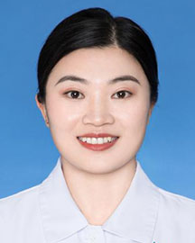

<!-- AUTO-GENERATED-BY: work/generate_obsidian_profiles.py -->

<!-- TEMPLATE: D:\workspace\信息收集整理\医生画像仓库\模板\医生画像模板.md -->

# 李惠平

## 基础信息

| 字段 | 内容 |
|---|---|
| 姓名 | 李惠平 |
| 医院 | 广东省人民医院 |
| 科室 | 精神科 |
| 职称/身份 | 中级心理治疗师 |
| 来源链接 | [官网原文](https://www.gdghospital.org.cn/Expertlistt/info_itemid_56714_subjectid_43.html) |
| 采集日期 | 2026-08-14 |

## 简介/擅长

使用积极心理、CBT、PET等技术解决青少年情绪、压力及睡眠、父母支持、家庭支持等问题

## 教育与进修经历

- 从事精神疾病护理工作11年，接受了心理咨询师培训以及认知行为治疗（CBT）、绘画艺术治疗、正念减压治疗、心理测量等系统培训。

## 可包装亮点

- 副主任护师，中级心理治疗师，精神科护士长 广东省护理学会心身护理专业委员会副主任委员。
- 广东省卫生信息网络协会智慧心理健康分会副会长。

## 重点疾病/人群标签

- 慢性病：
- 肿瘤：
- 生殖疾病：
- 免疫/风湿：
- 术后恢复/康复：
- 疑难重症：

## 证据摘录

> 只摘录官网公开信息中的短句或关键字段，不复制大段原文。

- 官网身份字段：中级心理治疗师
- 官网简介/擅长：使用积极心理、CBT、PET等技术解决青少年情绪、压力及睡眠、父母支持、家庭支持等问题
- 官网亮眼经历线索：副主任护师，中级心理治疗师，精神科护士长 广东省护理学会心身护理专业委员会副主任委员。 广东省卫生信息网络协会智慧心理健康分会副会长。
- 异常提示：职称/身份需人工复核
- 来源链接：https://www.gdghospital.org.cn/Expertlistt/info_itemid_56714_subjectid_43.html

## BD 画像摘要

李惠平医生可作为广东省人民医院精神科的基础医生资料入库。当前重点方向以总底表标签为准，官网未展示的信息保持空白。

## 合规边界

- 仅使用医院官网、官方公众号、官方小程序等公开渠道。
- 不采集私人电话、私人微信、家庭住址、患者隐私或非公开排班信息。
- 不写“保证治愈”“疗效第一”“包治疑难杂症”等无法由官网证明的表述。
