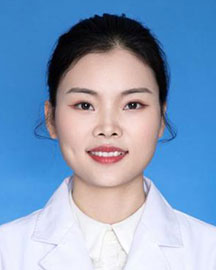

<!-- AUTO-GENERATED-BY: work/generate_obsidian_profiles.py -->

<!-- TEMPLATE: D:\workspace\信息收集整理\医生画像仓库\模板\医生画像模板.md -->

# 李文敏

## 基础信息

| 字段 | 内容 |
|---|---|
| 姓名 | 李文敏 |
| 医院 | 广东省人民医院 |
| 科室 | 检验科 |
| 职称/身份 | 主管技师 |
| 来源链接 | [官网原文](https://www.gdghospital.org.cn/Expertlistt/info_itemid_54426_subjectid_60.html) |
| 采集日期 | 2026-08-14 |

## 简介/擅长

## 教育与进修经历

- 现任检验科流式细胞组副组长,2017年毕业于南方医科大学免疫学专业后来我院工作.主要研究方向：肿瘤疾病免疫功能研究，感染检测新方法与新技术。

## 科研项目与成果

- 主持国家自然科学基金青年基金、广东省卫生厅课题一项，参与广州市科技及广东省厅级课题7项，发表国内外文章7篇。

## 论文与学术产出

- 主持国家自然科学基金青年基金、广东省卫生厅课题一项，参与广州市科技及广东省厅级课题7项，发表国内外文章7篇。

## 可包装亮点

- 主持国家自然科学基金青年基金、广东省卫生厅课题一项，参与广州市科技及广东省厅级课题7项，发表国内外文章7篇。

## 重点疾病/人群标签

- 慢性病：
- 肿瘤：
- 生殖疾病：
- 免疫/风湿：
- 术后恢复/康复：
- 疑难重症：

## 证据摘录

> 只摘录官网公开信息中的短句或关键字段，不复制大段原文。

- 官网身份字段：主管技师
- 官网亮眼经历线索：主持国家自然科学基金青年基金、广东省卫生厅课题一项，参与广州市科技及广东省厅级课题7项，发表国内外文章7篇。
- 异常提示：职称/身份需人工复核
- 来源链接：https://www.gdghospital.org.cn/Expertlistt/info_itemid_54426_subjectid_60.html

## BD 画像摘要

李文敏医生可作为广东省人民医院检验科的基础医生资料入库。当前重点方向以总底表标签为准，官网未展示的信息保持空白。

## 合规边界

- 仅使用医院官网、官方公众号、官方小程序等公开渠道。
- 不采集私人电话、私人微信、家庭住址、患者隐私或非公开排班信息。
- 不写“保证治愈”“疗效第一”“包治疑难杂症”等无法由官网证明的表述。
