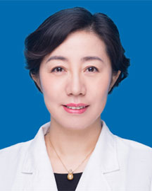

<!-- AUTO-GENERATED-BY: work/generate_obsidian_profiles.py -->

<!-- TEMPLATE: D:\workspace\信息收集整理\医生画像仓库\模板\医生画像模板.md -->

# 李文瑜

## 基础信息

| 字段 | 内容 |
|---|---|
| 姓名 | 李文瑜 |
| 医院 | 广东省人民医院 |
| 科室 | 淋巴瘤科 |
| 职称/身份 | 主任医师 |
| 来源链接 | [官网原文](https://www.gdghospital.org.cn/Expertlistt/info_itemid_23982_subjectid_34.html) |
| 采集日期 | 2026-08-14 |

## 简介/擅长

各种类型淋巴瘤的诊断、规范治疗、个体化治疗、靶向治疗、免疫治疗，尤其擅长以下疾病： （1）原发中枢神经系统淋巴瘤的诊断及个体化治疗

## 科研项目与成果

- 主持多项省科学基金、发表SCI文章十余篇。

## 论文与学术产出

- 主持多项省科学基金、发表SCI文章十余篇。

## 可包装亮点

- 医学博士，淋巴瘤科学科带头人、广东省人民医院淋巴瘤科行政主任；
- 华南理工大学医学院、南方医科大学、汕头大学医学院硕士生导师。
- 主持多项省科学基金、发表SCI文章十余篇。
- 学术任职： 广东省女医师协会淋巴瘤专业委员会主任委员 广东省女医师协会血液学专业委员会副主任委员 广东省女医师协会免疫学专业委员会副主任委员 广东省医学会肿瘤内科分会副主任委员 广州市血液肿瘤专业委员会副主任委员 广州市抗癌协会淋巴瘤专业委员会副主任委员 CACA青年委员会委员 美国血液协会会员 专业特长： 从事淋巴瘤专业20余年，擅长各种类型淋巴瘤的诊断…

## 重点疾病/人群标签

- 慢性病：
- 肿瘤：肿瘤、癌、淋巴瘤、靶向、免疫、难治
- 生殖疾病：
- 免疫/风湿：肿瘤、癌、淋巴瘤、靶向、免疫、难治
- 术后恢复/康复：
- 疑难重症：肿瘤、癌、淋巴瘤、靶向、免疫、难治

## 证据摘录

> 只摘录官网公开信息中的短句或关键字段，不复制大段原文。

- 官网身份字段：主任医师
- 官网简介/擅长：各种类型淋巴瘤的诊断、规范治疗、个体化治疗、靶向治疗、免疫治疗，尤其擅长以下疾病： （1）原发中枢神经系统淋巴瘤的诊断及个体化治疗
- 官网亮眼经历线索：医学博士，淋巴瘤科学科带头人、广东省人民医院淋巴瘤科行政主任； 华南理工大学医学院、南方医科大学、汕头大学医学院硕士生导师。 主持多项省科学基金、发表SCI文章十余篇。 学术任职： 广东省女医师协会淋巴瘤专业委员会主任委员 广东省女医师协会血液学专业委员会副主任委员 广东省女医师协会免疫学专业委员会副主任委员 广东省医学会肿瘤内科分会副主任委员 广州市血液肿瘤专业委员会副主任委员 广州市抗癌协会淋巴瘤专业委员会副主任委员 CACA青年…
- 来源链接：https://www.gdghospital.org.cn/Expertlistt/info_itemid_23982_subjectid_34.html

## BD 画像摘要

李文瑜医生可作为肿瘤、免疫/风湿/感染、疑难重症方向的基础画像候选。后续 BD 使用应继续以官网来源和人工复核为准，不添加疗效承诺或无来源包装。

## 合规边界

- 仅使用医院官网、官方公众号、官方小程序等公开渠道。
- 不采集私人电话、私人微信、家庭住址、患者隐私或非公开排班信息。
- 不写“保证治愈”“疗效第一”“包治疑难杂症”等无法由官网证明的表述。
