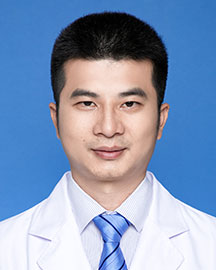

<!-- AUTO-GENERATED-BY: work/generate_obsidian_profiles.py -->

<!-- TEMPLATE: D:\workspace\信息收集整理\医生画像仓库\模板\医生画像模板.md -->

# 李晓华

## 基础信息

| 字段 | 内容 |
|---|---|
| 姓名 | 李晓华 |
| 医院 | 广东省人民医院 |
| 科室 | 心外科 |
| 职称/身份 | 副主任医师 |
| 来源链接 | [官网原文](https://www.gdghospital.org.cn/Expertlistt/info_itemid_24371_subjectid_80.html) |
| 采集日期 | 2026-08-14 |

## 简介/擅长

全周期先天性心脏病外科矫治，围手术期快速康复及术后无痛处理，擅长右腋下小切口、胸骨下段小切口微创手术，全胸腔镜下先天性心脏病/瓣膜病的外科手术：包括房间隔缺损合并肺静脉异位引流、二尖瓣及三尖瓣反流，室间隔缺损，部分房室间隔缺损，三房心等的全胸腔镜下矫治

## 教育与进修经历

- 2015年赴瑞典林雪平大学医学院附属心脏中心接受临床培训。

## 科研项目与成果

- 科研成果 主持广东省医学科研基金1项，参与国家“十二五”“十三五”课题及多个省、市级项目的研究工作。

## 论文与学术产出

- 在国内外专业期刊发表多篇学术论文。

## 可包装亮点

- 在国内外专业期刊发表多篇学术论文。
- 社会任职 国家心血管病专家委员会微创心血管外科专业委员会委员 广东省医院协会心脏血管微创外科管理专业委员会委员 广东省医疗安全协会结构性心脏病诊疗安全委员会常务委员

## 重点疾病/人群标签

- 慢性病：
- 肿瘤：
- 生殖疾病：
- 免疫/风湿：
- 术后恢复/康复：术后、康复、复杂
- 疑难重症：术后、康复、复杂

## 证据摘录

> 只摘录官网公开信息中的短句或关键字段，不复制大段原文。

- 官网身份字段：副主任医师
- 官网简介/擅长：全周期先天性心脏病外科矫治，围手术期快速康复及术后无痛处理，擅长右腋下小切口、胸骨下段小切口微创手术，全胸腔镜下先天性心脏病/瓣膜病的外科手术：包括房间隔缺损合并肺静脉异位引流、二尖瓣及三尖瓣反流，室间隔缺损，部分房室间隔缺损，三房心等的全胸腔镜下矫治
- 官网亮眼经历线索：在国内外专业期刊发表多篇学术论文。 社会任职 国家心血管病专家委员会微创心血管外科专业委员会委员 广东省医院协会心脏血管微创外科管理专业委员会委员 广东省医疗安全协会结构性心脏病诊疗安全委员会常务委员
- 来源链接：https://www.gdghospital.org.cn/Expertlistt/info_itemid_24371_subjectid_80.html

## BD 画像摘要

李晓华医生可作为术后恢复/康复、疑难重症方向的基础画像候选。后续 BD 使用应继续以官网来源和人工复核为准，不添加疗效承诺或无来源包装。

## 合规边界

- 仅使用医院官网、官方公众号、官方小程序等公开渠道。
- 不采集私人电话、私人微信、家庭住址、患者隐私或非公开排班信息。
- 不写“保证治愈”“疗效第一”“包治疑难杂症”等无法由官网证明的表述。
