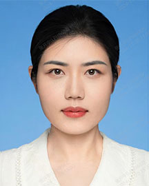

<!-- AUTO-GENERATED-BY: work/generate_obsidian_profiles.py -->

<!-- TEMPLATE: D:\workspace\信息收集整理\医生画像仓库\模板\医生画像模板.md -->

# 李树祎

## 基础信息

| 字段 | 内容 |
|---|---|
| 姓名 | 李树祎 |
| 医院 | 广东省人民医院 |
| 科室 | 口腔科门诊 |
| 职称/身份 | 医师 |
| 来源链接 | [官网原文](https://www.gdghospital.org.cn/Expertlistt/info_itemid_56852_subjectid_47.html) |
| 采集日期 | 2026-08-14 |

## 简介/擅长

颞下颌关节疾病（弹响、疼痛、张口受限等）、微创无痛数字化种植牙修复、口腔 种植植骨手术、口腔颌面畸形（地包天、歪斜、突嘴等）、肿瘤、外伤、各类牙齿 拔除、肿物切除等口腔科常见疾病诊疗

## 教育与进修经历

- 简介 博士，博士后，2018年国家留学基金委公派留学并获得荷兰阿姆斯特丹牙科学术 中心（ACTA，QS世界学科排名第二）口腔颌面外科学博士学位，承担国家自然科学基金青年基金等科研项目多项。

## 科研项目与成果

- 简介 博士，博士后，2018年国家留学基金委公派留学并获得荷兰阿姆斯特丹牙科学术 中心（ACTA，QS世界学科排名第二）口腔颌面外科学博士学位，承担国家自然科学基金青年基金等科研项目多项。
- 目前是广东省临 床医学学会牙种植学专业委员会青年委员、上海交大国家口腔疾病临床研究中心颞 下颌关节联盟成员、广东省保健协会口腔保健分会委员、德国口腔种植协会 （DGI）会员、中国生物医学工程学会组织工程与再生医学分会青年委员、广东省 生物医学工程学会生物3D打印与再生医学分会委员兼秘书等，参与国家重点研发 计划等科研项目。
- 累计发表SCI论文20余篇，获批专利3项。
- 荣誉奖励 广东省高校科研成果转化大赛三等奖。

## 论文与学术产出

- 累计发表SCI论文20余篇，获批专利3项。

## 可包装亮点

- 简介 博士，博士后，2018年国家留学基金委公派留学并获得荷兰阿姆斯特丹牙科学术 中心（ACTA，QS世界学科排名第二）口腔颌面外科学博士学位，承担国家自然科学基金青年基金等科研项目多项。
- 师从知名颞下颌关节与种植牙专家周苗教授，曾前往上海交大九院、德国、奥地利等地学习颞下颌关节与种植牙。
- 目前是广东省临 床医学学会牙种植学专业委员会青年委员、上海交大国家口腔疾病临床研究中心颞 下颌关节联盟成员、广东省保健协会口腔保健分会委员、德国口腔种植协会 （DGI）会员、中国生物医学工程学会组织工程与再生医学分会青年委员、广东省 生物医学工程学会生物3D打印与再生医学分会委员兼秘书等，参与国家重点研发 计划等科研项目。
- 累计发表SCI论文20余篇，获批专利3项。

## 重点疾病/人群标签

- 慢性病：
- 肿瘤：肿瘤、疼痛
- 生殖疾病：
- 免疫/风湿：
- 术后恢复/康复：肿瘤、疼痛
- 疑难重症：

## 证据摘录

> 只摘录官网公开信息中的短句或关键字段，不复制大段原文。

- 官网身份字段：医师
- 官网简介/擅长：颞下颌关节疾病（弹响、疼痛、张口受限等）、微创无痛数字化种植牙修复、口腔 种植植骨手术、口腔颌面畸形（地包天、歪斜、突嘴等）、肿瘤、外伤、各类牙齿 拔除、肿物切除等口腔科常见疾病诊疗
- 官网亮眼经历线索：简介 博士，博士后，2018年国家留学基金委公派留学并获得荷兰阿姆斯特丹牙科学术 中心（ACTA，QS世界学科排名第二）口腔颌面外科学博士学位，承担国家自然科学基金青年基金等科研项目多项。 师从知名颞下颌关节与种植牙专家周苗教授，曾前往上海交大九院、德国、奥地利等地学习颞下颌关节与种植牙。 目前是广东省临 床医学学会牙种植学专业委员会青年委员、上海交大国家口腔疾病临床研究中心颞 下颌关节联盟成员、广东省保健协会口腔保健分会委员、德国口…
- 来源链接：https://www.gdghospital.org.cn/Expertlistt/info_itemid_56852_subjectid_47.html

## BD 画像摘要

李树祎医生可作为肿瘤、术后恢复/康复方向的基础画像候选。后续 BD 使用应继续以官网来源和人工复核为准，不添加疗效承诺或无来源包装。

## 合规边界

- 仅使用医院官网、官方公众号、官方小程序等公开渠道。
- 不采集私人电话、私人微信、家庭住址、患者隐私或非公开排班信息。
- 不写“保证治愈”“疗效第一”“包治疑难杂症”等无法由官网证明的表述。
