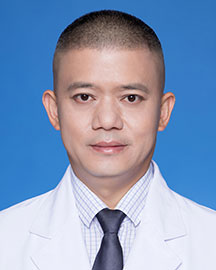

<!-- AUTO-GENERATED-BY: work/generate_obsidian_profiles.py -->

<!-- TEMPLATE: D:\workspace\信息收集整理\医生画像仓库\模板\医生画像模板.md -->

# 李楠

## 基础信息

| 字段 | 内容 |
|---|---|
| 姓名 | 李楠 |
| 医院 | 广东省人民医院 |
| 科室 | 皮肤性病科 |
| 职称/身份 | 副主任医生 |
| 来源链接 | [官网原文](https://www.gdghospital.org.cn/Expertlistt/info_itemid_23893_subjectid_22.html) |
| 采集日期 | 2026-08-14 |

## 简介/擅长

## 教育与进修经历

- 曾去北京协和医院皮肤科进修接受国内名家指点半年。

## 科研项目与成果

- 主持省级科研课题两项。

## 可包装亮点

- 广东省医学会皮肤科分会委员。
- 曾去北京协和医院皮肤科进修接受国内名家指点半年。
- 对各种皮肤科常见病及疑难病例，真菌，性传播疾病和激光美容的疗效深受患者好评。

## 重点疾病/人群标签

- 慢性病：
- 肿瘤：
- 生殖疾病：
- 免疫/风湿：
- 术后恢复/康复：
- 疑难重症：疑难

## 证据摘录

> 只摘录官网公开信息中的短句或关键字段，不复制大段原文。

- 官网身份字段：副主任医生
- 官网亮眼经历线索：广东省医学会皮肤科分会委员。 曾去北京协和医院皮肤科进修接受国内名家指点半年。 对各种皮肤科常见病及疑难病例，真菌，性传播疾病和激光美容的疗效深受患者好评。
- 来源链接：https://www.gdghospital.org.cn/Expertlistt/info_itemid_23893_subjectid_22.html

## BD 画像摘要

李楠医生可作为疑难重症方向的基础画像候选。后续 BD 使用应继续以官网来源和人工复核为准，不添加疗效承诺或无来源包装。

## 合规边界

- 仅使用医院官网、官方公众号、官方小程序等公开渠道。
- 不采集私人电话、私人微信、家庭住址、患者隐私或非公开排班信息。
- 不写“保证治愈”“疗效第一”“包治疑难杂症”等无法由官网证明的表述。
