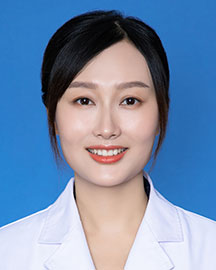

<!-- AUTO-GENERATED-BY: work/generate_obsidian_profiles.py -->

<!-- TEMPLATE: D:\workspace\信息收集整理\医生画像仓库\模板\医生画像模板.md -->

# 李洁清

## 基础信息

| 字段 | 内容 |
|---|---|
| 姓名 | 李洁清 |
| 医院 | 广东省人民医院 |
| 科室 | 乳腺肿瘤科 |
| 职称/身份 | 副主任医师 |
| 来源链接 | [官网原文](https://www.gdghospital.org.cn/Expertlistt/info_itemid_25056_subjectid_30.html) |
| 采集日期 | 2026-08-14 |

## 简介/擅长

擅长乳腺疾病的早期筛查与鉴别诊断

## 教育与进修经历

- 简介 医学博士，毕业于四川大学华西临床医学院医学八年制，美国加州大学洛杉矶分校（UCLA）博士后，从事临床工作近20年，临床经验丰富。

## 科研项目与成果

- 社会任职 广东省精准医学应用学会乳腺肿瘤分会委员、国际微无创医学会青年委员会委员、肿瘤诊疗技术转化管理专业委员会委员、中国医药卫生事业发展基金会“健康中国公益强医”乳腺癌多学科精准诊疗学组组员。

## 论文与学术产出

- 先后担任科室内科、外科治疗组组长，全程管理经验丰富，注重循证规范化与基因导向下的个体化精准治疗，重视患者人文关怀，多次在国内顶级医学媒体发表规范化诊疗案例。

## 可包装亮点

- 精通乳腺肿瘤手术，对微小结节和淋巴结的精准定位取材具备突出能力；
- 擅长乳腺癌外科、内科个体化精准综合治疗：主攻HR+HER2‑乳腺癌内分泌、晚期三阴性乳腺癌精准诊疗，开设乳腺癌内分泌精准靶向门诊；
- 简介 医学博士，毕业于四川大学华西临床医学院医学八年制，美国加州大学洛杉矶分校（UCLA）博士后，从事临床工作近20年，临床经验丰富。
- 先后担任科室内科、外科治疗组组长，全程管理经验丰富，注重循证规范化与基因导向下的个体化精准治疗，重视患者人文关怀，多次在国内顶级医学媒体发表规范化诊疗案例。

## 重点疾病/人群标签

- 慢性病：
- 肿瘤：肿瘤、靶向、乳腺癌、多学科
- 生殖疾病：
- 免疫/风湿：
- 术后恢复/康复：
- 疑难重症：肿瘤、靶向、乳腺癌、多学科

## 证据摘录

> 只摘录官网公开信息中的短句或关键字段，不复制大段原文。

- 官网身份字段：副主任医师
- 官网简介/擅长：擅长乳腺疾病的早期筛查与鉴别诊断
- 官网亮眼经历线索：精通乳腺肿瘤手术，对微小结节和淋巴结的精准定位取材具备突出能力； 擅长乳腺癌外科、内科个体化精准综合治疗：主攻HR+HER2‑乳腺癌内分泌、晚期三阴性乳腺癌精准诊疗，开设乳腺癌内分泌精准靶向门诊； 简介 医学博士，毕业于四川大学华西临床医学院医学八年制，美国加州大学洛杉矶分校（UCLA）博士后，从事临床工作近20年，临床经验丰富。 先后担任科室内科、外科治疗组组长，全程管理经验丰富，注重循证规范化与基因导向下的个体化精准治疗，重视患者…
- 来源链接：https://www.gdghospital.org.cn/Expertlistt/info_itemid_25056_subjectid_30.html

## BD 画像摘要

李洁清医生可作为肿瘤、疑难重症方向的基础画像候选。后续 BD 使用应继续以官网来源和人工复核为准，不添加疗效承诺或无来源包装。

## 合规边界

- 仅使用医院官网、官方公众号、官方小程序等公开渠道。
- 不采集私人电话、私人微信、家庭住址、患者隐私或非公开排班信息。
- 不写“保证治愈”“疗效第一”“包治疑难杂症”等无法由官网证明的表述。
