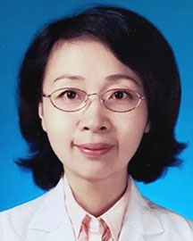

<!-- AUTO-GENERATED-BY: work/generate_obsidian_profiles.py -->

<!-- TEMPLATE: D:\workspace\信息收集整理\医生画像仓库\模板\医生画像模板.md -->

# 李洋

## 基础信息

| 字段 | 内容 |
|---|---|
| 姓名 | 李洋 |
| 医院 | 广东省人民医院 |
| 科室 | 风湿免疫科 |
| 职称/身份 | 主任医师 科主任 |
| 来源链接 | [官网原文](https://www.gdghospital.org.cn/Expertlistt/info_itemid_40419_subjectid_21.html) |
| 采集日期 | 2026-08-14 |

## 简介/擅长

系统性红斑狼疮、系统性血管炎、皮肌炎、系统性硬化症、类风湿关节炎、强直性脊柱炎等各类风湿免疫性疾病的临床诊治及复杂疑难性疾病的临床救治

## 教育与进修经历

- 1998-2004年留学日本并获得九州大学医学博士；

## 科研项目与成果

- 2011-2021年任哈尔滨医科大学附属第二医院风湿免疫科主任，学科带头人，“国家临床重点专科建设项目”负责人。
- 主持完成国家自然科学基金3项，其他省部级课题多项，作为分中心负责人完成国际国内多中心新药临床试验数十项，培养硕士研究生40余人，博士研究生15人。

## 可包装亮点

- 特长 擅长系统性红斑狼疮、系统性血管炎、皮肌炎、系统性硬化症、类风湿关节炎、强直性脊柱炎等各类风湿免疫性疾病的临床诊治及复杂疑难性疾病的临床救治。
- 简介 风湿免疫科行政主任、学术带头人，主任医师、教授、博士生导师。
- 2011-2021年任哈尔滨医科大学附属第二医院风湿免疫科主任，学科带头人，“国家临床重点专科建设项目”负责人。
- 2021年6月“高层次人才引进”至广东省人民医院任风湿免疫科行政主任及学术带头人。

## 重点疾病/人群标签

- 慢性病：
- 肿瘤：
- 生殖疾病：
- 免疫/风湿：风湿、免疫、红斑狼疮、类风湿、强直性脊柱炎、疑难、复杂
- 术后恢复/康复：
- 疑难重症：风湿、免疫、红斑狼疮、类风湿、强直性脊柱炎、疑难、复杂

## 证据摘录

> 只摘录官网公开信息中的短句或关键字段，不复制大段原文。

- 官网身份字段：主任医师 科主任
- 官网简介/擅长：系统性红斑狼疮、系统性血管炎、皮肌炎、系统性硬化症、类风湿关节炎、强直性脊柱炎等各类风湿免疫性疾病的临床诊治及复杂疑难性疾病的临床救治
- 官网亮眼经历线索：特长 擅长系统性红斑狼疮、系统性血管炎、皮肌炎、系统性硬化症、类风湿关节炎、强直性脊柱炎等各类风湿免疫性疾病的临床诊治及复杂疑难性疾病的临床救治。 简介 风湿免疫科行政主任、学术带头人，主任医师、教授、博士生导师。 2011-2021年任哈尔滨医科大学附属第二医院风湿免疫科主任，学科带头人，“国家临床重点专科建设项目”负责人。 2021年6月“高层次人才引进”至广东省人民医院任风湿免疫科行政主任及学术带头人。
- 来源链接：https://www.gdghospital.org.cn/Expertlistt/info_itemid_40419_subjectid_21.html

## BD 画像摘要

李洋医生可作为免疫/风湿/感染、疑难重症方向的基础画像候选。后续 BD 使用应继续以官网来源和人工复核为准，不添加疗效承诺或无来源包装。

## 合规边界

- 仅使用医院官网、官方公众号、官方小程序等公开渠道。
- 不采集私人电话、私人微信、家庭住址、患者隐私或非公开排班信息。
- 不写“保证治愈”“疗效第一”“包治疑难杂症”等无法由官网证明的表述。
