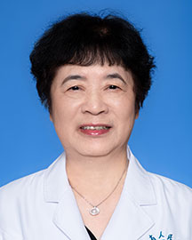

<!-- AUTO-GENERATED-BY: work/generate_obsidian_profiles.py -->

<!-- TEMPLATE: D:\workspace\信息收集整理\医生画像仓库\模板\医生画像模板.md -->

# 李渝芬

## 基础信息

| 字段 | 内容 |
|---|---|
| 姓名 | 李渝芬 |
| 医院 | 广东省人民医院 |
| 科室 | 心儿科、心脏母胎医学科 |
| 职称/身份 | 主任医师 |
| 来源链接 | [官网原文](https://www.gdghospital.org.cn/Expertlistt/info_itemid_24413_subjectid_81.html) |
| 采集日期 | 2026-08-14 |

## 简介/擅长

小儿及胎儿心血管疾病的诊治

## 科研项目与成果

- 获得省、厅科技成果奖十二项，1998年获广东省科技突出贡献三等奖，1999年获广东省五一劳动奖章，2016年获中国儿科医师终身成就奖，2019年获广东省人民医院广东心研所终身成就奖、2020年获广东省医师协会儿科分会杰出贡献奖。

## 论文与学术产出

- 曾任心血管儿科主任，发表论文六十余篇，参与专业书籍编写十余本。

## 可包装亮点

- 曾任心血管儿科主任，发表论文六十余篇，参与专业书籍编写十余本。
- 获得省、厅科技成果奖十二项，1998年获广东省科技突出贡献三等奖，1999年获广东省五一劳动奖章，2016年获中国儿科医师终身成就奖，2019年获广东省人民医院广东心研所终身成就奖、2020年获广东省医师协会儿科分会杰出贡献奖。

## 重点疾病/人群标签

- 慢性病：
- 肿瘤：
- 生殖疾病：
- 免疫/风湿：风湿
- 术后恢复/康复：
- 疑难重症：

## 证据摘录

> 只摘录官网公开信息中的短句或关键字段，不复制大段原文。

- 官网身份字段：主任医师
- 官网简介/擅长：小儿及胎儿心血管疾病的诊治
- 官网亮眼经历线索：曾任心血管儿科主任，发表论文六十余篇，参与专业书籍编写十余本。 获得省、厅科技成果奖十二项，1998年获广东省科技突出贡献三等奖，1999年获广东省五一劳动奖章，2016年获中国儿科医师终身成就奖，2019年获广东省人民医院广东心研所终身成就奖、2020年获广东省医师协会儿科分会杰出贡献奖。
- 来源链接：https://www.gdghospital.org.cn/Expertlistt/info_itemid_24413_subjectid_81.html

## BD 画像摘要

李渝芬医生可作为免疫/风湿/感染方向的基础画像候选。后续 BD 使用应继续以官网来源和人工复核为准，不添加疗效承诺或无来源包装。

## 合规边界

- 仅使用医院官网、官方公众号、官方小程序等公开渠道。
- 不采集私人电话、私人微信、家庭住址、患者隐私或非公开排班信息。
- 不写“保证治愈”“疗效第一”“包治疑难杂症”等无法由官网证明的表述。
