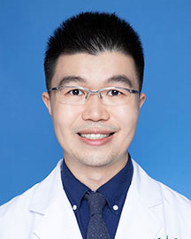

<!-- AUTO-GENERATED-BY: work/generate_obsidian_profiles.py -->

<!-- TEMPLATE: D:\workspace\信息收集整理\医生画像仓库\模板\医生画像模板.md -->

# 李焯辉

## 基础信息

| 字段 | 内容 |
|---|---|
| 姓名 | 李焯辉 |
| 医院 | 广东省人民医院 |
| 科室 | 乳腺科 |
| 职称/身份 | 医师 |
| 来源链接 | [官网原文](https://www.gdghospital.org.cn/Expertlistt/info_itemid_32873_subjectid_29.html) |
| 采集日期 | 2026-08-14 |

## 简介/擅长

乳腺癌早期诊断、综合治疗

## 教育与进修经历

- 本科毕业于中山大学临床医学五年制，后于中山大学附属第一医院硕博连读获得外科学博士学位。
- 师从广东省人民医院乳腺科廖宁主任学习乳腺癌精准诊疗，多次赴国内外进修学习，掌握乳腺专科常见疾病诊治，擅长乳腺癌早期诊断、综合治疗。

## 科研项目与成果

- 以第一作者发表SCI文章5篇，获发明专利一项，主持科研基金两项，参与包括国家自然科学基金等各级研究课题多项。

## 论文与学术产出

- 以第一作者发表SCI文章5篇，获发明专利一项，主持科研基金两项，参与包括国家自然科学基金等各级研究课题多项。

## 可包装亮点

- 医学博士 广东省药学会乳腺癌专业委员会委员 广东省基层医药学会乳腺癌专业委员会委员 获2018年Chicago Sister Cities International Medical Initiative Award,并赴美国芝加哥Northwester大学Feinberg医学院学习。
- 师从广东省人民医院乳腺科廖宁主任学习乳腺癌精准诊疗，多次赴国内外进修学习，掌握乳腺专科常见疾病诊治，擅长乳腺癌早期诊断、综合治疗。
- 以第一作者发表SCI文章5篇，获发明专利一项，主持科研基金两项，参与包括国家自然科学基金等各级研究课题多项。
- 擅长处理乳腺癌疑难案例，于广东省人民医院廖宁教授周三见国际会诊为国际协会主席担任同声传译。

## 重点疾病/人群标签

- 慢性病：
- 肿瘤：肿瘤、乳腺癌、疑难
- 生殖疾病：
- 免疫/风湿：
- 术后恢复/康复：
- 疑难重症：肿瘤、乳腺癌、疑难

## 证据摘录

> 只摘录官网公开信息中的短句或关键字段，不复制大段原文。

- 官网身份字段：医师
- 官网简介/擅长：乳腺癌早期诊断、综合治疗
- 官网亮眼经历线索：医学博士 广东省药学会乳腺癌专业委员会委员 广东省基层医药学会乳腺癌专业委员会委员 获2018年Chicago Sister Cities International Medical Initiative Award,并赴美国芝加哥Northwester大学Feinberg医学院学习。 师从广东省人民医院乳腺科廖宁主任学习乳腺癌精准诊疗，多次赴国内外进修学习，掌握乳腺专科常见疾病诊治，擅长乳腺癌早期诊断、综合治疗。 以第一作者发表SC…
- 来源链接：https://www.gdghospital.org.cn/Expertlistt/info_itemid_32873_subjectid_29.html

## BD 画像摘要

李焯辉医生可作为肿瘤、疑难重症方向的基础画像候选。后续 BD 使用应继续以官网来源和人工复核为准，不添加疗效承诺或无来源包装。

## 合规边界

- 仅使用医院官网、官方公众号、官方小程序等公开渠道。
- 不采集私人电话、私人微信、家庭住址、患者隐私或非公开排班信息。
- 不写“保证治愈”“疗效第一”“包治疑难杂症”等无法由官网证明的表述。
