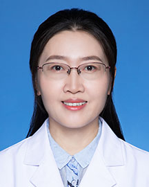

<!-- AUTO-GENERATED-BY: work/generate_obsidian_profiles.py -->

<!-- TEMPLATE: D:\workspace\信息收集整理\医生画像仓库\模板\医生画像模板.md -->

# 李玲

## 基础信息

| 字段 | 内容 |
|---|---|
| 姓名 | 李玲 |
| 医院 | 广东省人民医院 |
| 科室 | 风湿免疫科 |
| 职称/身份 | 主任医师 |
| 来源链接 | [官网原文](https://www.gdghospital.org.cn/Expertlistt/info_itemid_24729_subjectid_21.html) |
| 采集日期 | 2026-08-14 |

## 简介/擅长

从事临床一线工作近30年，擅长高频肌骨超声可视化技术在风湿免疫病尤其是各种风湿关节炎的早期诊断和精准化治疗中的临床应用

## 教育与进修经历

- 2010年起国内首批参加肌骨超声培训，2013年在意大利进修超声技术，2015年获新技术进步三等奖。
- 工作经历 2005年毕业于中国协和医科大学北京协和医院 风湿免疫专业 医学博士 2005年全国中级医师资格考试荣获风湿免疫专业第一名 主持和参与国家级、省市级和厅级科研课题多项，在SCI、国家核心期刊发表学术论文数十篇。

## 科研项目与成果

- 工作经历 2005年毕业于中国协和医科大学北京协和医院 风湿免疫专业 医学博士 2005年全国中级医师资格考试荣获风湿免疫专业第一名 主持和参与国家级、省市级和厅级科研课题多项，在SCI、国家核心期刊发表学术论文数十篇。

## 论文与学术产出

- 工作经历 2005年毕业于中国协和医科大学北京协和医院 风湿免疫专业 医学博士 2005年全国中级医师资格考试荣获风湿免疫专业第一名 主持和参与国家级、省市级和厅级科研课题多项，在SCI、国家核心期刊发表学术论文数十篇。
- 其中肌骨超声研究在ARD、Arthritis and Rheumatology、Rheumatology和Seminars in Arthritis and Rheumtism等国际著名期刊发表，累计影响因子50余分，引领类风湿关节炎、强直性脊柱炎、银屑病关节炎、骨关节炎等肌骨超声评价的行业标准。
- 参与制定《中国纤维肌痛康复指南（2021）》、《纤维肌痛运动干预实践指南（2021年）》、《纤维肌痛规范化诊疗中国心身-风湿专家共识》以及最新纤维肌痛患者指南，参与完成中华医学会心身医学分会开展的《综合医院心身疾病患病率及影响因素分析》并发表论文。

## 可包装亮点

- 负责风湿科教学工作二十余年，科室连年荣获优秀教学奖项。
- 担任医院教育指导委员会委员和教学督导，承担华南理工大学医学院和南方医科大学本科教学和《临床医学导论》课程负责人。
- 专业擅长 从事临床一线工作近30年，擅长高频肌骨超声可视化技术在风湿免疫病尤其是各种风湿关节炎的早期诊断和精准化治疗中的临床应用。
- 2010年起国内首批参加肌骨超声培训，2013年在意大利进修超声技术，2015年获新技术进步三等奖。

## 重点疾病/人群标签

- 慢性病：慢性、靶向、风湿、免疫、红斑狼疮、类风湿、强直性脊柱炎、术后、康复、疑难、危重、重症、难治
- 肿瘤：慢性、靶向、风湿、免疫、红斑狼疮、类风湿、强直性脊柱炎、术后、康复、疑难、危重、重症、难治
- 生殖疾病：
- 免疫/风湿：慢性、靶向、风湿、免疫、红斑狼疮、类风湿、强直性脊柱炎、术后、康复、疑难、危重、重症、难治
- 术后恢复/康复：慢性、靶向、风湿、免疫、红斑狼疮、类风湿、强直性脊柱炎、术后、康复、疑难、危重、重症、难治
- 疑难重症：慢性、靶向、风湿、免疫、红斑狼疮、类风湿、强直性脊柱炎、术后、康复、疑难、危重、重症、难治

## 证据摘录

> 只摘录官网公开信息中的短句或关键字段，不复制大段原文。

- 官网身份字段：主任医师
- 官网简介/擅长：从事临床一线工作近30年，擅长高频肌骨超声可视化技术在风湿免疫病尤其是各种风湿关节炎的早期诊断和精准化治疗中的临床应用
- 官网亮眼经历线索：负责风湿科教学工作二十余年，科室连年荣获优秀教学奖项。 担任医院教育指导委员会委员和教学督导，承担华南理工大学医学院和南方医科大学本科教学和《临床医学导论》课程负责人。 专业擅长 从事临床一线工作近30年，擅长高频肌骨超声可视化技术在风湿免疫病尤其是各种风湿关节炎的早期诊断和精准化治疗中的临床应用。 2010年起国内首批参加肌骨超声培训，2013年在意大利进修超声技术，2015年获新技术进步三等奖。
- 来源链接：https://www.gdghospital.org.cn/Expertlistt/info_itemid_24729_subjectid_21.html

## BD 画像摘要

李玲医生可作为慢性病、肿瘤、免疫/风湿/感染、术后恢复/康复、疑难重症方向的基础画像候选。后续 BD 使用应继续以官网来源和人工复核为准，不添加疗效承诺或无来源包装。

## 合规边界

- 仅使用医院官网、官方公众号、官方小程序等公开渠道。
- 不采集私人电话、私人微信、家庭住址、患者隐私或非公开排班信息。
- 不写“保证治愈”“疗效第一”“包治疑难杂症”等无法由官网证明的表述。
