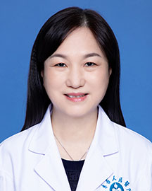

<!-- AUTO-GENERATED-BY: work/generate_obsidian_profiles.py -->

<!-- TEMPLATE: D:\workspace\信息收集整理\医生画像仓库\模板\医生画像模板.md -->

# 李萍

## 基础信息

| 字段 | 内容 |
|---|---|
| 姓名 | 李萍 |
| 医院 | 广东省人民医院 |
| 科室 | 产科 |
| 职称/身份 | 主任医师 |
| 来源链接 | [官网原文](https://www.gdghospital.org.cn/Expertlistt/info_itemid_24842_subjectid_52.html) |
| 采集日期 | 2026-08-14 |

## 简介/擅长

主攻优生遗传咨询与产前诊断，先天性心脏病的遗传研究

## 教育与进修经历

- 1986年毕业于中山医科大学临床医疗系，医学学士。

## 可包装亮点

- 2000年赴美国弗吉尼亚州遗传中心学习 。
- 社会任职 ： 广东省地中海贫血防治协会预防专业委员会副主任委员 中华医学会医学遗传学分会细胞遗传学组委员 广东省医学会产前诊断分会常委 广东省医学会医学遗传学分会常委 广东省医学会围产医学分会产前诊断学组委员

## 重点疾病/人群标签

- 慢性病：
- 肿瘤：
- 生殖疾病：
- 免疫/风湿：
- 术后恢复/康复：
- 疑难重症：

## 证据摘录

> 只摘录官网公开信息中的短句或关键字段，不复制大段原文。

- 官网身份字段：主任医师
- 官网简介/擅长：主攻优生遗传咨询与产前诊断，先天性心脏病的遗传研究
- 官网亮眼经历线索：2000年赴美国弗吉尼亚州遗传中心学习 。 社会任职 ： 广东省地中海贫血防治协会预防专业委员会副主任委员 中华医学会医学遗传学分会细胞遗传学组委员 广东省医学会产前诊断分会常委 广东省医学会医学遗传学分会常委 广东省医学会围产医学分会产前诊断学组委员
- 来源链接：https://www.gdghospital.org.cn/Expertlistt/info_itemid_24842_subjectid_52.html

## BD 画像摘要

李萍医生可作为广东省人民医院产科的基础医生资料入库。当前重点方向以总底表标签为准，官网未展示的信息保持空白。

## 合规边界

- 仅使用医院官网、官方公众号、官方小程序等公开渠道。
- 不采集私人电话、私人微信、家庭住址、患者隐私或非公开排班信息。
- 不写“保证治愈”“疗效第一”“包治疑难杂症”等无法由官网证明的表述。
