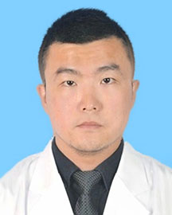

<!-- AUTO-GENERATED-BY: work/generate_obsidian_profiles.py -->

<!-- TEMPLATE: D:\workspace\信息收集整理\医生画像仓库\模板\医生画像模板.md -->

# 李西

## 基础信息

| 字段 | 内容 |
|---|---|
| 姓名 | 李西 |
| 医院 | 广东省人民医院 |
| 科室 | 微创介入科 |
| 职称/身份 | 主治医师/副研究员 |
| 来源链接 | [官网原文](https://www.gdghospital.org.cn/Expertlistt/info_itemid_71410_subjectid_32.html) |
| 采集日期 | 2026-08-14 |

## 简介/擅长

1、熟练掌握静脉畸形、动静脉畸形、淋巴管畸形、儿童血管瘤、肝血管瘤、肾错构瘤的介入治疗

## 教育与进修经历

- 简介 第二军医大学医学博士、中山大学博士后、梅奥医学中心留学经历；

## 科研项目与成果

- 主持国家自然科学金青年项目，广东省自然科学基金，发表SCI论文20余篇；

## 论文与学术产出

- 主持国家自然科学金青年项目，广东省自然科学基金，发表SCI论文20余篇；

## 可包装亮点

- 主持国家自然科学金青年项目，广东省自然科学基金，发表SCI论文20余篇；
- 广东省医学会微创外科分会委员。

## 重点疾病/人群标签

- 慢性病：
- 肿瘤：瘤、放疗、化疗、靶向、肝癌、免疫、疼痛
- 生殖疾病：
- 免疫/风湿：瘤、放疗、化疗、靶向、肝癌、免疫、疼痛
- 术后恢复/康复：瘤、放疗、化疗、靶向、肝癌、免疫、疼痛
- 疑难重症：

## 证据摘录

> 只摘录官网公开信息中的短句或关键字段，不复制大段原文。

- 官网身份字段：主治医师/副研究员
- 官网简介/擅长：1、熟练掌握静脉畸形、动静脉畸形、淋巴管畸形、儿童血管瘤、肝血管瘤、肾错构瘤的介入治疗
- 官网亮眼经历线索：主持国家自然科学金青年项目，广东省自然科学基金，发表SCI论文20余篇； 广东省医学会微创外科分会委员。
- 来源链接：https://www.gdghospital.org.cn/Expertlistt/info_itemid_71410_subjectid_32.html

## BD 画像摘要

李西医生可作为肿瘤、免疫/风湿/感染、术后恢复/康复方向的基础画像候选。后续 BD 使用应继续以官网来源和人工复核为准，不添加疗效承诺或无来源包装。

## 合规边界

- 仅使用医院官网、官方公众号、官方小程序等公开渠道。
- 不采集私人电话、私人微信、家庭住址、患者隐私或非公开排班信息。
- 不写“保证治愈”“疗效第一”“包治疑难杂症”等无法由官网证明的表述。
