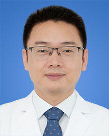

<!-- AUTO-GENERATED-BY: work/generate_obsidian_profiles.py -->

<!-- TEMPLATE: D:\workspace\信息收集整理\医生画像仓库\模板\医生画像模板.md -->

# 李跃

## 基础信息

| 字段 | 内容 |
|---|---|
| 姓名 | 李跃 |
| 医院 | 广东省人民医院 |
| 科室 | 消化内镜中心 |
| 职称/身份 | 主任医师 科主任 |
| 来源链接 | [官网原文](https://www.gdghospital.org.cn/Expertlistt/info_itemid_55493_subjectid_103.html) |
| 采集日期 | 2026-08-14 |

## 简介/擅长

消化系统疾病的内镜下诊治，包括胃肠道息肉、胃肠道早期肿瘤、胃肠道间质瘤、贲门失迟缓症、胆管结石及胆囊结石、胰腺及胸腹腔肿瘤穿刺活检、胆胰管引流等，尤其擅长复杂疾病的多种内镜联合治疗技术及内镜减肥术，在华南地区率先开展了多项高难度新技术，例如超声内镜引导下胃肠吻合术、内镜联合腔镜切除巨大胃黏膜下肿瘤、内镜下袖状胃成形术、超声内镜引导下胆管十二指肠吻合术等

## 教育与进修经历

- 简介 消化内镜中心主任、主任医师、美国约翰.霍普金斯大学医学院博士后 第六届“羊城青年好医生”，第七届“羊城好医生” 学术任职 1.中华医学会消化内镜分会第九届青年学组委员 2.中华医学会消化内镜分会第九届病理协作组副组长 3.中华医学会消化内镜分会第八届超声内镜学组委员 4.中华医学会消化病学分会第十二届胰腺学组委员 5.广东省基层医药学会内镜减重专委会主任委员 6.广东省肝脏病学会超声内镜专委会主任委员

## 可包装亮点

- 专长 消化系统疾病的内镜下诊治，包括胃肠道息肉、胃肠道早期肿瘤、胃肠道间质瘤、贲门失迟缓症、胆管结石及胆囊结石、胰腺及胸腹腔肿瘤穿刺活检、胆胰管引流等，尤其擅长复杂疾病的多种内镜联合治疗技术及内镜减肥术，在华南地区率先开展了多项高难度新技术，例如超声内镜引导下胃肠吻合术、内镜联合腔镜切除巨大胃黏膜下肿瘤、内镜下袖状胃成形术、超声内镜引导下胆管十二指肠吻合术…
- 简介 消化内镜中心主任、主任医师、美国约翰.霍普金斯大学医学院博士后 第六届“羊城青年好医生”，第七届“羊城好医生” 学术任职 1.中华医学会消化内镜分会第九届青年学组委员 2.中华医学会消化内镜分会第九届病理协作组副组长 3.中华医学会消化内镜分会第八届超声内镜学组委员 4.中华医学会消化病学分会第十二届胰腺学组委员 5.广东省基层医药学会内镜减重专委会…

## 重点疾病/人群标签

- 慢性病：
- 肿瘤：肿瘤、瘤、复杂
- 生殖疾病：
- 免疫/风湿：
- 术后恢复/康复：
- 疑难重症：肿瘤、瘤、复杂

## 证据摘录

> 只摘录官网公开信息中的短句或关键字段，不复制大段原文。

- 官网身份字段：主任医师 科主任
- 官网简介/擅长：消化系统疾病的内镜下诊治，包括胃肠道息肉、胃肠道早期肿瘤、胃肠道间质瘤、贲门失迟缓症、胆管结石及胆囊结石、胰腺及胸腹腔肿瘤穿刺活检、胆胰管引流等，尤其擅长复杂疾病的多种内镜联合治疗技术及内镜减肥术，在华南地区率先开展了多项高难度新技术，例如超声内镜引导下胃肠吻合术、内镜联合腔镜切除巨大胃黏膜下肿瘤、内镜下袖状胃成形术、超声内镜引导下胆管十二指肠吻合术等
- 官网亮眼经历线索：专长 消化系统疾病的内镜下诊治，包括胃肠道息肉、胃肠道早期肿瘤、胃肠道间质瘤、贲门失迟缓症、胆管结石及胆囊结石、胰腺及胸腹腔肿瘤穿刺活检、胆胰管引流等，尤其擅长复杂疾病的多种内镜联合治疗技术及内镜减肥术，在华南地区率先开展了多项高难度新技术，例如超声内镜引导下胃肠吻合术、内镜联合腔镜切除巨大胃黏膜下肿瘤、内镜下袖状胃成形术、超声内镜引导下胆管十二指肠吻合术等。 简介 消化内镜中心主任、主任医师、美国约翰.霍普金斯大学医学院博士后 第六…
- 来源链接：https://www.gdghospital.org.cn/Expertlistt/info_itemid_55493_subjectid_103.html

## BD 画像摘要

李跃医生可作为肿瘤、疑难重症方向的基础画像候选。后续 BD 使用应继续以官网来源和人工复核为准，不添加疗效承诺或无来源包装。

## 合规边界

- 仅使用医院官网、官方公众号、官方小程序等公开渠道。
- 不采集私人电话、私人微信、家庭住址、患者隐私或非公开排班信息。
- 不写“保证治愈”“疗效第一”“包治疑难杂症”等无法由官网证明的表述。
