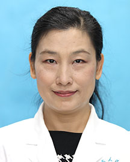

<!-- AUTO-GENERATED-BY: work/generate_obsidian_profiles.py -->

<!-- TEMPLATE: D:\workspace\信息收集整理\医生画像仓库\模板\医生画像模板.md -->

# 李静

## 基础信息

| 字段 | 内容 |
|---|---|
| 姓名 | 李静 |
| 医院 | 广东省人民医院 |
| 科室 | 呼吸与危重症医学科 |
| 职称/身份 | 主任医师 科主任 |
| 来源链接 | [官网原文](https://www.gdghospital.org.cn/Expertlistt/info_itemid_25375_subjectid_19.html) |
| 采集日期 | 2026-08-14 |

## 简介/擅长

诊治呼吸内科危重及疑难杂症，精通呼吸介入各项高新技术的操作技能，如气道内支架置入术、冷热消融术、微球囊置入术，气管支气管瘘微创封堵技术及内科胸腔镜检查术等

## 教育与进修经历

- 呼吸与危重症医学科行政主任，中华医学会呼吸病学会介入呼吸病学学组委员、广东省女医师协会呼吸与危重症专业委员会主任委员 研究方向：介入性呼吸病学 毕业于复旦大学上海医学院。
- 曾于日本、德国进修。

## 科研项目与成果

- 主持和参与了多项省、部级科研项目，在国内外期刊上发表文章20余篇，参与著作编写4部。

## 论文与学术产出

- 主持和参与了多项省、部级科研项目，在国内外期刊上发表文章20余篇，参与著作编写4部。

## 可包装亮点

- 呼吸与危重症医学科行政主任，中华医学会呼吸病学会介入呼吸病学学组委员、广东省女医师协会呼吸与危重症专业委员会主任委员 研究方向：介入性呼吸病学 毕业于复旦大学上海医学院。
- 从事呼吸内科临床工作二十余年，擅长诊治呼吸内科危重及疑难杂症，精通呼吸介入各项高新技术的操作技能，如气道内支架置入术、冷热消融术、微球囊置入术，气管支气管瘘微创封堵技术及内科胸腔镜检查术等。
- 曾于日本、德国进修。
- 主持和参与了多项省、部级科研项目，在国内外期刊上发表文章20余篇，参与著作编写4部。

## 重点疾病/人群标签

- 慢性病：
- 肿瘤：
- 生殖疾病：
- 免疫/风湿：
- 术后恢复/康复：
- 疑难重症：疑难、危重

## 证据摘录

> 只摘录官网公开信息中的短句或关键字段，不复制大段原文。

- 官网身份字段：主任医师 科主任
- 官网简介/擅长：诊治呼吸内科危重及疑难杂症，精通呼吸介入各项高新技术的操作技能，如气道内支架置入术、冷热消融术、微球囊置入术，气管支气管瘘微创封堵技术及内科胸腔镜检查术等
- 官网亮眼经历线索：呼吸与危重症医学科行政主任，中华医学会呼吸病学会介入呼吸病学学组委员、广东省女医师协会呼吸与危重症专业委员会主任委员 研究方向：介入性呼吸病学 毕业于复旦大学上海医学院。 从事呼吸内科临床工作二十余年，擅长诊治呼吸内科危重及疑难杂症，精通呼吸介入各项高新技术的操作技能，如气道内支架置入术、冷热消融术、微球囊置入术，气管支气管瘘微创封堵技术及内科胸腔镜检查术等。 曾于日本、德国进修。 主持和参与了多项省、部级科研项目，在国内外期刊上发表…
- 来源链接：https://www.gdghospital.org.cn/Expertlistt/info_itemid_25375_subjectid_19.html

## BD 画像摘要

李静医生可作为疑难重症方向的基础画像候选。后续 BD 使用应继续以官网来源和人工复核为准，不添加疗效承诺或无来源包装。

## 合规边界

- 仅使用医院官网、官方公众号、官方小程序等公开渠道。
- 不采集私人电话、私人微信、家庭住址、患者隐私或非公开排班信息。
- 不写“保证治愈”“疗效第一”“包治疑难杂症”等无法由官网证明的表述。
