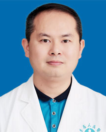

<!-- AUTO-GENERATED-BY: work/generate_obsidian_profiles.py -->

<!-- TEMPLATE: D:\workspace\信息收集整理\医生画像仓库\模板\医生画像模板.md -->

# 杨冬阳

## 基础信息

| 字段 | 内容 |
|---|---|
| 姓名 | 杨冬阳 |
| 医院 | 广东省人民医院 |
| 科室 | 肿瘤内科 |
| 职称/身份 | 副主任医师 |
| 来源链接 | [官网原文](https://www.gdghospital.org.cn/Expertlistt/info_itemid_25087_subjectid_33.html) |
| 采集日期 | 2026-08-14 |

## 简介/擅长

各种实体瘤诊治，擅长消化系统恶性肿瘤如结直肠癌、胃癌、食管癌、肝癌、胰腺癌等规范化、多学科综合治疗，擅长癌症康复及癌痛治疗

## 科研项目与成果

- 主持省厅级课题3项，参与国自然、省、厅多项科研项目。
- 在国内外期刊发表学术论文多篇，参与多项国内外多中心临床研究项目。

## 论文与学术产出

- 在国内外期刊发表学术论文多篇，参与多项国内外多中心临床研究项目。

## 可包装亮点

- 中共党员 从事肿瘤内科临床工作10余年，熟悉各种实体瘤诊治，擅长消化系统恶性肿瘤如结直肠癌、胃癌、食管癌、肝癌、胰腺癌等规范化、多学科综合治疗，擅长癌症康复及癌痛治疗。
- 在国内外期刊发表学术论文多篇，参与多项国内外多中心临床研究项目。
- 协会兼职：中国临床肿瘤协会（CSCO）会员，广东省抗癌协会癌症康复与姑息治疗青年专业委员会副主任委员，广州市抗癌协会消化道肿瘤青年委员会副主任委员，广东省抗癌协会大肠癌专业委员会内科组委员，广州市抗癌学会大肠癌专业委员会委员等。

## 重点疾病/人群标签

- 慢性病：
- 肿瘤：肿瘤、癌、瘤、肝癌、胃癌、肠癌、康复、姑息、多学科
- 生殖疾病：
- 免疫/风湿：
- 术后恢复/康复：肿瘤、癌、瘤、肝癌、胃癌、肠癌、康复、姑息、多学科
- 疑难重症：肿瘤、癌、瘤、肝癌、胃癌、肠癌、康复、姑息、多学科

## 证据摘录

> 只摘录官网公开信息中的短句或关键字段，不复制大段原文。

- 官网身份字段：副主任医师
- 官网简介/擅长：各种实体瘤诊治，擅长消化系统恶性肿瘤如结直肠癌、胃癌、食管癌、肝癌、胰腺癌等规范化、多学科综合治疗，擅长癌症康复及癌痛治疗
- 官网亮眼经历线索：中共党员 从事肿瘤内科临床工作10余年，熟悉各种实体瘤诊治，擅长消化系统恶性肿瘤如结直肠癌、胃癌、食管癌、肝癌、胰腺癌等规范化、多学科综合治疗，擅长癌症康复及癌痛治疗。 在国内外期刊发表学术论文多篇，参与多项国内外多中心临床研究项目。 协会兼职：中国临床肿瘤协会（CSCO）会员，广东省抗癌协会癌症康复与姑息治疗青年专业委员会副主任委员，广州市抗癌协会消化道肿瘤青年委员会副主任委员，广东省抗癌协会大肠癌专业委员会内科组委员，广州市抗癌学…
- 来源链接：https://www.gdghospital.org.cn/Expertlistt/info_itemid_25087_subjectid_33.html

## BD 画像摘要

杨冬阳医生可作为肿瘤、术后恢复/康复、疑难重症方向的基础画像候选。后续 BD 使用应继续以官网来源和人工复核为准，不添加疗效承诺或无来源包装。

## 合规边界

- 仅使用医院官网、官方公众号、官方小程序等公开渠道。
- 不采集私人电话、私人微信、家庭住址、患者隐私或非公开排班信息。
- 不写“保证治愈”“疗效第一”“包治疑难杂症”等无法由官网证明的表述。
