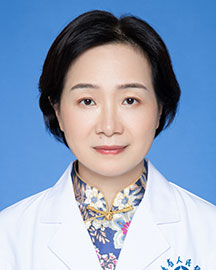

<!-- AUTO-GENERATED-BY: work/generate_obsidian_profiles.py -->

<!-- TEMPLATE: D:\workspace\信息收集整理\医生画像仓库\模板\医生画像模板.md -->

# 杨春艳

## 基础信息

| 字段 | 内容 |
|---|---|
| 姓名 | 杨春艳 |
| 医院 | 广东省人民医院 |
| 科室 | 产科 |
| 职称/身份 | 副主任医师 |
| 来源链接 | [官网原文](https://www.gdghospital.org.cn/Expertlistt/info_itemid_24844_subjectid_52.html) |
| 采集日期 | 2026-08-14 |

## 简介/擅长

擅长处理普通产科、高危产科情况

## 教育与进修经历

- 中国医科大学临床医学专业 学士学位，中山大学附属孙逸仙纪念医院 围产医学 硕士学位；
- 2002年至中山大学附属第一医院胎儿医学中心进修胎儿医学相关内容，2007年至香港大学玛丽医院进修，主要进修内容为产前诊断。

## 可包装亮点

- 2002年至中山大学附属第一医院胎儿医学中心进修胎儿医学相关内容，2007年至香港大学玛丽医院进修，主要进修内容为产前诊断。
- 社会任职 ： 中华医学会广东省围产医学分会流产与早产组委员 广东省医师协会妇产科分会委员 广东省医师学会母胎医学分会委员

## 重点疾病/人群标签

- 慢性病：
- 肿瘤：
- 生殖疾病：
- 免疫/风湿：
- 术后恢复/康复：
- 疑难重症：高危

## 证据摘录

> 只摘录官网公开信息中的短句或关键字段，不复制大段原文。

- 官网身份字段：副主任医师
- 官网简介/擅长：擅长处理普通产科、高危产科情况
- 官网亮眼经历线索：2002年至中山大学附属第一医院胎儿医学中心进修胎儿医学相关内容，2007年至香港大学玛丽医院进修，主要进修内容为产前诊断。 社会任职 ： 中华医学会广东省围产医学分会流产与早产组委员 广东省医师协会妇产科分会委员 广东省医师学会母胎医学分会委员
- 来源链接：https://www.gdghospital.org.cn/Expertlistt/info_itemid_24844_subjectid_52.html

## BD 画像摘要

杨春艳医生可作为疑难重症方向的基础画像候选。后续 BD 使用应继续以官网来源和人工复核为准，不添加疗效承诺或无来源包装。

## 合规边界

- 仅使用医院官网、官方公众号、官方小程序等公开渠道。
- 不采集私人电话、私人微信、家庭住址、患者隐私或非公开排班信息。
- 不写“保证治愈”“疗效第一”“包治疑难杂症”等无法由官网证明的表述。
