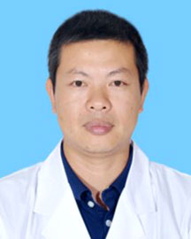

<!-- AUTO-GENERATED-BY: work/generate_obsidian_profiles.py -->

<!-- TEMPLATE: D:\workspace\信息收集整理\医生画像仓库\模板\医生画像模板.md -->

# 杨航

## 基础信息

| 字段 | 内容 |
|---|---|
| 姓名 | 杨航 |
| 医院 | 广东省人民医院 |
| 科室 | 急诊科 |
| 职称/身份 | 主治医师 |
| 来源链接 | [官网原文](https://www.gdghospital.org.cn/Expertlistt/info_itemid_33775_subjectid_112.html) |
| 采集日期 | 2026-08-14 |

## 简介/擅长

## 教育与进修经历

- 学会任职： 珠海市应急协会常务副会长 珠海市金湾区应急专家组成员 广东省精准医学毒物与中毒分会常委 医学会急诊分会副主委 珠海市医师协会急诊分会副主委 广东省医学教育协会全科医学与基层医疗卫生专业委员会常委 珠海市中西医结合学会重症医学专业分会常委 中华医学会急诊分会临床技术培训学组委员 中国医药教育协会胸痛专业委员会委员 广东省中医药学会热病分会委员 个人荣誉：2008年汶川大地震获得“抗震救灾”广东省人民医院“一等功”。
- 2000年毕业于中山医科大学，一直从事急诊急救和危重症救治工作，对突发公共卫生事件、灾难医学与救援有较深的研究，对危重病人呼吸治疗、脓毒症、脓毒症休克、血流动力学、心肺脑复苏、团队复苏等有丰富的临床经验。

## 科研项目与成果

- 科研方面，发表SCI论文二篇，参与广东省卫生厅、广东省科技厅等医学科研课题。

## 论文与学术产出

- 科研方面，发表SCI论文二篇，参与广东省卫生厅、广东省科技厅等医学科研课题。

## 可包装亮点

- 学会任职： 珠海市应急协会常务副会长 珠海市金湾区应急专家组成员 广东省精准医学毒物与中毒分会常委 医学会急诊分会副主委 珠海市医师协会急诊分会副主委 广东省医学教育协会全科医学与基层医疗卫生专业委员会常委 珠海市中西医结合学会重症医学专业分会常委 中华医学会急诊分会临床技术培训学组委员 中国医药教育协会胸痛专业委员会委员 广东省中医药学会热病分会委员 个…
- 2000年毕业于中山医科大学，一直从事急诊急救和危重症救治工作，对突发公共卫生事件、灾难医学与救援有较深的研究，对危重病人呼吸治疗、脓毒症、脓毒症休克、血流动力学、心肺脑复苏、团队复苏等有丰富的临床经验。
- 科研方面，发表SCI论文二篇，参与广东省卫生厅、广东省科技厅等医学科研课题。

## 重点疾病/人群标签

- 慢性病：
- 肿瘤：
- 生殖疾病：
- 免疫/风湿：
- 术后恢复/康复：
- 疑难重症：危重、重症

## 证据摘录

> 只摘录官网公开信息中的短句或关键字段，不复制大段原文。

- 官网身份字段：主治医师
- 官网亮眼经历线索：学会任职： 珠海市应急协会常务副会长 珠海市金湾区应急专家组成员 广东省精准医学毒物与中毒分会常委 医学会急诊分会副主委 珠海市医师协会急诊分会副主委 广东省医学教育协会全科医学与基层医疗卫生专业委员会常委 珠海市中西医结合学会重症医学专业分会常委 中华医学会急诊分会临床技术培训学组委员 中国医药教育协会胸痛专业委员会委员 广东省中医药学会热病分会委员 个人荣誉：2008年汶川大地震获得“抗震救灾”广东省人民医院“一等功”。 2000…
- 来源链接：https://www.gdghospital.org.cn/Expertlistt/info_itemid_33775_subjectid_112.html

## BD 画像摘要

杨航医生可作为疑难重症方向的基础画像候选。后续 BD 使用应继续以官网来源和人工复核为准，不添加疗效承诺或无来源包装。

## 合规边界

- 仅使用医院官网、官方公众号、官方小程序等公开渠道。
- 不采集私人电话、私人微信、家庭住址、患者隐私或非公开排班信息。
- 不写“保证治愈”“疗效第一”“包治疑难杂症”等无法由官网证明的表述。
