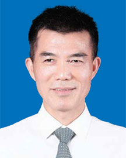

<!-- AUTO-GENERATED-BY: work/generate_obsidian_profiles.py -->

<!-- TEMPLATE: D:\workspace\信息收集整理\医生画像仓库\模板\医生画像模板.md -->

# 杨衿记

## 基础信息

| 字段 | 内容 |
|---|---|
| 姓名 | 杨衿记 |
| 医院 | 广东省人民医院 |
| 科室 | 肺内一科 |
| 职称/身份 | 主任医师 |
| 来源链接 | [官网原文](https://www.gdghospital.org.cn/Expertlistt/info_itemid_23175_subjectid_24.html) |
| 采集日期 | 2026-08-14 |

## 简介/擅长

肺癌的精准治疗和转化研究

## 教育与进修经历

- 毕业于中山医科大学（Sun Yat-Sen University of Medical Sciences，SUMS）六年制临床医学系全英班。
- 肺癌内科主任医师，博士生导师，博士后合作导师。
- 曾留学丹麦和美国。

## 论文与学术产出

- 毕业于中山医科大学（Sun Yat-Sen University of Medical Sciences，SUMS）六年制临床医学系全英班。
- 主编《怒放的生命》、《钻石突变，十年磨一剑》和《肺癌患者的生命笔记》。
- 2023～2025年度全球前2%顶尖科学家（World’s Top2% Scientists）。

## 可包装亮点

- 肺癌内科主任医师，博士生导师，博士后合作导师。
- 曾留学丹麦和美国。
- 擅长肺癌的精准治疗和转化研究。
- 3.肺癌类器官精准医学。

## 重点疾病/人群标签

- 慢性病：
- 肿瘤：肺癌、MDT
- 生殖疾病：
- 免疫/风湿：
- 术后恢复/康复：
- 疑难重症：肺癌、MDT

## 证据摘录

> 只摘录官网公开信息中的短句或关键字段，不复制大段原文。

- 官网身份字段：主任医师
- 官网简介/擅长：肺癌的精准治疗和转化研究
- 官网亮眼经历线索：肺癌内科主任医师，博士生导师，博士后合作导师。 曾留学丹麦和美国。 擅长肺癌的精准治疗和转化研究。 3.肺癌类器官精准医学。
- 来源链接：https://www.gdghospital.org.cn/Expertlistt/info_itemid_23175_subjectid_24.html

## BD 画像摘要

杨衿记医生可作为肿瘤、疑难重症方向的基础画像候选。后续 BD 使用应继续以官网来源和人工复核为准，不添加疗效承诺或无来源包装。

## 合规边界

- 仅使用医院官网、官方公众号、官方小程序等公开渠道。
- 不采集私人电话、私人微信、家庭住址、患者隐私或非公开排班信息。
- 不写“保证治愈”“疗效第一”“包治疑难杂症”等无法由官网证明的表述。
