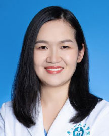

<!-- AUTO-GENERATED-BY: work/generate_obsidian_profiles.py -->

<!-- TEMPLATE: D:\workspace\信息收集整理\医生画像仓库\模板\医生画像模板.md -->

# 林伍梅

## 基础信息

| 字段 | 内容 |
|---|---|
| 姓名 | 林伍梅 |
| 医院 | 广东省人民医院 |
| 科室 | 妇科 |
| 职称/身份 | 副主任医师 |
| 来源链接 | [官网原文](https://www.gdghospital.org.cn/Expertlistt/info_itemid_32896_subjectid_51.html) |
| 采集日期 | 2026-08-14 |

## 简介/擅长

擅长微创途径治疗子宫肌瘤、卵巢肿瘤、子宫内膜异位症

## 可包装亮点

- 秉承“以患者为中心”的理念，作风严谨，态度诚恳，擅于结合患者具体情况制定个体化精准治疗方案。
- 简介 第十届羊城好医生，从事妇科肿瘤领域临床工作20+年。
- 广东省医师协会妇科肿瘤学分会常委 广东省医学会妇科内镜分会常委 广东省医师协会子宫内膜异位症专业委员会常委 广东省医学会学妇科分会常委 广东省医师协会妇科内镜分会委员 广东省医学会学肿瘤精准诊疗分会委员 广东省医学会妇科肿瘤学分会委员

## 重点疾病/人群标签

- 慢性病：
- 肿瘤：肿瘤、癌、瘤、卵巢
- 生殖疾病：肿瘤、癌、瘤、卵巢
- 免疫/风湿：
- 术后恢复/康复：
- 疑难重症：

## 证据摘录

> 只摘录官网公开信息中的短句或关键字段，不复制大段原文。

- 官网身份字段：副主任医师
- 官网简介/擅长：擅长微创途径治疗子宫肌瘤、卵巢肿瘤、子宫内膜异位症
- 官网亮眼经历线索：秉承“以患者为中心”的理念，作风严谨，态度诚恳，擅于结合患者具体情况制定个体化精准治疗方案。 简介 第十届羊城好医生，从事妇科肿瘤领域临床工作20+年。 广东省医师协会妇科肿瘤学分会常委 广东省医学会妇科内镜分会常委 广东省医师协会子宫内膜异位症专业委员会常委 广东省医学会学妇科分会常委 广东省医师协会妇科内镜分会委员 广东省医学会学肿瘤精准诊疗分会委员 广东省医学会妇科肿瘤学分会委员
- 来源链接：https://www.gdghospital.org.cn/Expertlistt/info_itemid_32896_subjectid_51.html

## BD 画像摘要

林伍梅医生可作为肿瘤、生殖疾病方向的基础画像候选。后续 BD 使用应继续以官网来源和人工复核为准，不添加疗效承诺或无来源包装。

## 合规边界

- 仅使用医院官网、官方公众号、官方小程序等公开渠道。
- 不采集私人电话、私人微信、家庭住址、患者隐私或非公开排班信息。
- 不写“保证治愈”“疗效第一”“包治疑难杂症”等无法由官网证明的表述。
