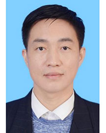

<!-- AUTO-GENERATED-BY: work/generate_obsidian_profiles.py -->

<!-- TEMPLATE: D:\workspace\信息收集整理\医生画像仓库\模板\医生画像模板.md -->

# 林晓

## 基础信息

| 字段 | 内容 |
|---|---|
| 姓名 | 林晓 |
| 医院 | 广东省人民医院 |
| 科室 | 急诊科 |
| 职称/身份 | 副主任医师 |
| 来源链接 | [官网原文](https://www.gdghospital.org.cn/Expertlistt/info_itemid_33772_subjectid_112.html) |
| 采集日期 | 2026-08-14 |

## 简介/擅长

领域：从事重症和急诊医学十多年，对各种疑难危重症及急诊疾病的救治具有丰富的临床经验

## 教育与进修经历

- 个人经历：2006年毕业于广州医科大学后一直在广东省人民医院从事临床工作，无出国进修和工作经历。
- 教育：本科毕业，学士学位 学会任职：广东省中西医结合学会急救医学专业委员会委员。

## 论文与学术产出

- 发表论文：参与发表国内核心期刊论文若干篇。

## 可包装亮点

- 擅长领域：从事重症和急诊医学十多年，对各种疑难危重症及急诊疾病的救治具有丰富的临床经验。
- 擅长各种危重及急诊疾病的诊治和抢救，特别是对各种类型的休克、多器官功能障碍综合征、心衰、重症哮喘、急性呼吸衰竭、重症急性胰腺炎、糖尿病酮症酸中毒、重症肺炎、重型颅脑损伤及各种中毒等。
- 个人经历：2006年毕业于广州医科大学后一直在广东省人民医院从事临床工作，无出国进修和工作经历。
- 教育：本科毕业，学士学位 学会任职：广东省中西医结合学会急救医学专业委员会委员。

## 重点疾病/人群标签

- 慢性病：糖尿病、心衰、功能障碍、疑难、危重、重症
- 肿瘤：
- 生殖疾病：
- 免疫/风湿：
- 术后恢复/康复：糖尿病、心衰、功能障碍、疑难、危重、重症
- 疑难重症：糖尿病、心衰、功能障碍、疑难、危重、重症

## 证据摘录

> 只摘录官网公开信息中的短句或关键字段，不复制大段原文。

- 官网身份字段：副主任医师
- 官网简介/擅长：领域：从事重症和急诊医学十多年，对各种疑难危重症及急诊疾病的救治具有丰富的临床经验
- 官网亮眼经历线索：擅长领域：从事重症和急诊医学十多年，对各种疑难危重症及急诊疾病的救治具有丰富的临床经验。 擅长各种危重及急诊疾病的诊治和抢救，特别是对各种类型的休克、多器官功能障碍综合征、心衰、重症哮喘、急性呼吸衰竭、重症急性胰腺炎、糖尿病酮症酸中毒、重症肺炎、重型颅脑损伤及各种中毒等。 个人经历：2006年毕业于广州医科大学后一直在广东省人民医院从事临床工作，无出国进修和工作经历。 教育：本科毕业，学士学位 学会任职：广东省中西医结合学会急救医学专…
- 来源链接：https://www.gdghospital.org.cn/Expertlistt/info_itemid_33772_subjectid_112.html

## BD 画像摘要

林晓医生可作为慢性病、术后恢复/康复、疑难重症方向的基础画像候选。后续 BD 使用应继续以官网来源和人工复核为准，不添加疗效承诺或无来源包装。

## 合规边界

- 仅使用医院官网、官方公众号、官方小程序等公开渠道。
- 不采集私人电话、私人微信、家庭住址、患者隐私或非公开排班信息。
- 不写“保证治愈”“疗效第一”“包治疑难杂症”等无法由官网证明的表述。
