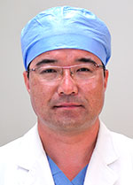

<!-- AUTO-GENERATED-BY: work/generate_obsidian_profiles.py -->

<!-- TEMPLATE: D:\workspace\信息收集整理\医生画像仓库\模板\医生画像模板.md -->

# 柴云飞

## 基础信息

| 字段 | 内容 |
|---|---|
| 姓名 | 柴云飞 |
| 医院 | 广东省人民医院 |
| 科室 | 麻醉科 |
| 职称/身份 | 主任医师 |
| 来源链接 | [官网原文](https://www.gdghospital.org.cn/Expertlistt/info_itemid_24357_subjectid_13.html) |
| 采集日期 | 2026-08-14 |

## 简介/擅长

## 教育与进修经历

- 医学博士 毕业于四川大学，从事临床麻醉和科研教学工作二十年，现主要从事临床心血管麻醉工作，在危重症心脏手术麻醉、小儿心脏麻醉、临床急救复苏等方面有较丰富的经验。

## 科研项目与成果

- 医学博士 毕业于四川大学，从事临床麻醉和科研教学工作二十年，现主要从事临床心血管麻醉工作，在危重症心脏手术麻醉、小儿心脏麻醉、临床急救复苏等方面有较丰富的经验。
- 承担和参与多项省部级及国家级课题项目研究，已发表研究论文十余篇，其中SCI收录4篇、ASA年会交流论文5篇，中文期刊论文数篇。

## 论文与学术产出

- 承担和参与多项省部级及国家级课题项目研究，已发表研究论文十余篇，其中SCI收录4篇、ASA年会交流论文5篇，中文期刊论文数篇。

## 可包装亮点

- 医学博士 毕业于四川大学，从事临床麻醉和科研教学工作二十年，现主要从事临床心血管麻醉工作，在危重症心脏手术麻醉、小儿心脏麻醉、临床急救复苏等方面有较丰富的经验。
- 承担和参与多项省部级及国家级课题项目研究，已发表研究论文十余篇，其中SCI收录4篇、ASA年会交流论文5篇，中文期刊论文数篇。

## 重点疾病/人群标签

- 慢性病：
- 肿瘤：
- 生殖疾病：
- 免疫/风湿：
- 术后恢复/康复：
- 疑难重症：危重

## 证据摘录

> 只摘录官网公开信息中的短句或关键字段，不复制大段原文。

- 官网身份字段：主任医师
- 官网亮眼经历线索：医学博士 毕业于四川大学，从事临床麻醉和科研教学工作二十年，现主要从事临床心血管麻醉工作，在危重症心脏手术麻醉、小儿心脏麻醉、临床急救复苏等方面有较丰富的经验。 承担和参与多项省部级及国家级课题项目研究，已发表研究论文十余篇，其中SCI收录4篇、ASA年会交流论文5篇，中文期刊论文数篇。
- 来源链接：https://www.gdghospital.org.cn/Expertlistt/info_itemid_24357_subjectid_13.html

## BD 画像摘要

柴云飞医生可作为疑难重症方向的基础画像候选。后续 BD 使用应继续以官网来源和人工复核为准，不添加疗效承诺或无来源包装。

## 合规边界

- 仅使用医院官网、官方公众号、官方小程序等公开渠道。
- 不采集私人电话、私人微信、家庭住址、患者隐私或非公开排班信息。
- 不写“保证治愈”“疗效第一”“包治疑难杂症”等无法由官网证明的表述。
