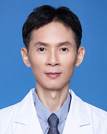

<!-- AUTO-GENERATED-BY: work/generate_obsidian_profiles.py -->

<!-- TEMPLATE: D:\workspace\信息收集整理\医生画像仓库\模板\医生画像模板.md -->

# 梁伟民

## 基础信息

| 字段 | 内容 |
|---|---|
| 姓名 | 梁伟民 |
| 医院 | 广东省人民医院 |
| 科室 | 消化内镜中心 |
| 职称/身份 | 主治医师 |
| 来源链接 | [官网原文](https://www.gdghospital.org.cn/Expertlistt/info_itemid_24659_subjectid_103.html) |
| 采集日期 | 2026-08-14 |

## 简介/擅长

消化系统疾病的临床诊治，擅长EUS及小肠镜，能熟练开展消化内镜精查、消化道肿瘤内镜切除、消化道异物取出、消化道出血及狭窄的内镜治疗、PEG/J、ERCP、ESD等内镜诊疗操作

## 可包装亮点

- 消化系统疾病的临床诊治，擅长EUS及小肠镜，能熟练开展消化内镜精查、消化道肿瘤内镜切除、消化道异物取出、消化道出血及狭窄的内镜治疗、PEG/J、ERCP、ESD等内镜诊疗操作

## 重点疾病/人群标签

- 慢性病：
- 肿瘤：肿瘤
- 生殖疾病：
- 免疫/风湿：
- 术后恢复/康复：
- 疑难重症：

## 证据摘录

> 只摘录官网公开信息中的短句或关键字段，不复制大段原文。

- 官网身份字段：主治医师
- 官网简介/擅长：消化系统疾病的临床诊治，擅长EUS及小肠镜，能熟练开展消化内镜精查、消化道肿瘤内镜切除、消化道异物取出、消化道出血及狭窄的内镜治疗、PEG/J、ERCP、ESD等内镜诊疗操作
- 来源链接：https://www.gdghospital.org.cn/Expertlistt/info_itemid_24659_subjectid_103.html

## BD 画像摘要

梁伟民医生可作为肿瘤方向的基础画像候选。后续 BD 使用应继续以官网来源和人工复核为准，不添加疗效承诺或无来源包装。

## 合规边界

- 仅使用医院官网、官方公众号、官方小程序等公开渠道。
- 不采集私人电话、私人微信、家庭住址、患者隐私或非公开排班信息。
- 不写“保证治愈”“疗效第一”“包治疑难杂症”等无法由官网证明的表述。
