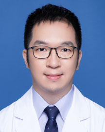

<!-- AUTO-GENERATED-BY: work/generate_obsidian_profiles.py -->

<!-- TEMPLATE: D:\workspace\信息收集整理\医生画像仓库\模板\医生画像模板.md -->

# 梁国彦

## 基础信息

| 字段 | 内容 |
|---|---|
| 姓名 | 梁国彦 |
| 医院 | 广东省人民医院 |
| 科室 | 脊柱外科 |
| 职称/身份 | 主治医师 |
| 来源链接 | [官网原文](https://www.gdghospital.org.cn/Expertlistt/info_itemid_24315_subjectid_48.html) |
| 采集日期 | 2026-08-14 |

## 简介/擅长

各种颈椎、腰椎等脊柱相关疾病的治疗，掌握国际最新诊疗技术，包括颈椎病、腰椎间盘突出、椎管狭窄症、骨质疏松等的最新方案

## 教育与进修经历

- 医学博士、硕士生导师，美国哈佛大学访问研究员 社会任职 国际颈椎研究学会会员 国际颈椎研究学会亚太分会（CSRS-AP）活跃会员 亚太颈椎研究学会中国部创始会员 广东省医学会脊柱外科分会会员 广东省康复医学会颈椎外科专委会会员 教育经历和专业特长 中山大学中山医学院本科毕业，免试保送中山大学硕博连读骨科学博士。
- 拥有丰富国外培训经历：曾于美国康奈尔大学长老会医院颈椎外科接受培训，师从美国颈椎外科协会前主席Daniel Riew教授；
- 曾于美国哈佛大学接受培训，师从副院长Yang教授；
- 曾于韩国釜山海云台医院接受培训，师从颈椎外科协会亚太分会前主席Han Chang教授。

## 科研项目与成果

- 学术专业领域成就 广东省自然科学基金“青年提升”人才项目获得者；
- 广东省人民医院后备人才项目入选人；
- 发表高影响力SCI十余篇，拥有专利二十余项，主持国家自然科学基金、广东省自然科学基金、广东省人民医院临床研究等多个研究项目。

## 论文与学术产出

- 广东省医学会脊柱外科分会中青年医师优秀论文大赛冠军；
- 发表高影响力SCI十余篇，拥有专利二十余项，主持国家自然科学基金、广东省自然科学基金、广东省人民医院临床研究等多个研究项目。

## 可包装亮点

- 医学博士、硕士生导师，美国哈佛大学访问研究员 社会任职 国际颈椎研究学会会员 国际颈椎研究学会亚太分会（CSRS-AP）活跃会员 亚太颈椎研究学会中国部创始会员 广东省医学会脊柱外科分会会员 广东省康复医学会颈椎外科专委会会员 教育经历和专业特长 中山大学中山医学院本科毕业，免试保送中山大学硕博连读骨科学博士。
- 两次获“中华人民共和国优秀学生/研究生国家奖学金”。
- 拥有丰富国外培训经历：曾于美国康奈尔大学长老会医院颈椎外科接受培训，师从美国颈椎外科协会前主席Daniel Riew教授；
- 曾于美国哈佛大学接受培训，师从副院长Yang教授；

## 重点疾病/人群标签

- 慢性病：
- 肿瘤：
- 生殖疾病：
- 免疫/风湿：
- 术后恢复/康复：康复
- 疑难重症：

## 证据摘录

> 只摘录官网公开信息中的短句或关键字段，不复制大段原文。

- 官网身份字段：主治医师
- 官网简介/擅长：各种颈椎、腰椎等脊柱相关疾病的治疗，掌握国际最新诊疗技术，包括颈椎病、腰椎间盘突出、椎管狭窄症、骨质疏松等的最新方案
- 官网亮眼经历线索：医学博士、硕士生导师，美国哈佛大学访问研究员 社会任职 国际颈椎研究学会会员 国际颈椎研究学会亚太分会（CSRS-AP）活跃会员 亚太颈椎研究学会中国部创始会员 广东省医学会脊柱外科分会会员 广东省康复医学会颈椎外科专委会会员 教育经历和专业特长 中山大学中山医学院本科毕业，免试保送中山大学硕博连读骨科学博士。 两次获“中华人民共和国优秀学生/研究生国家奖学金”。 拥有丰富国外培训经历：曾于美国康奈尔大学长老会医院颈椎外科接受培训，师…
- 来源链接：https://www.gdghospital.org.cn/Expertlistt/info_itemid_24315_subjectid_48.html

## BD 画像摘要

梁国彦医生可作为术后恢复/康复方向的基础画像候选。后续 BD 使用应继续以官网来源和人工复核为准，不添加疗效承诺或无来源包装。

## 合规边界

- 仅使用医院官网、官方公众号、官方小程序等公开渠道。
- 不采集私人电话、私人微信、家庭住址、患者隐私或非公开排班信息。
- 不写“保证治愈”“疗效第一”“包治疑难杂症”等无法由官网证明的表述。
