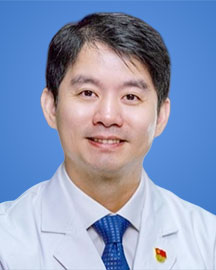

<!-- AUTO-GENERATED-BY: work/generate_obsidian_profiles.py -->

<!-- TEMPLATE: D:\workspace\信息收集整理\医生画像仓库\模板\医生画像模板.md -->

# 梁昌详

## 基础信息

| 字段 | 内容 |
|---|---|
| 姓名 | 梁昌详 |
| 医院 | 广东省人民医院 |
| 科室 | 脊柱外科 |
| 职称/身份 | 主任医师 |
| 来源链接 | [官网原文](https://www.gdghospital.org.cn/Expertlistt/info_itemid_24310_subjectid_48.html) |
| 采集日期 | 2026-08-14 |

## 简介/擅长

颈椎手术，胸腰椎微创手术及脊柱畸形手术

## 教育与进修经历

- 脊柱外科副主任、佛冈人民医院 副书记 院长 毕业于复旦大学，从事脊柱外科专业20年。
- 曾在国内上海、广州两个临床中心接受脊柱外科规范培训，此后在美国，比利时及以色列等国际临床中心接受系统的专业训练。

## 可包装亮点

- 曾在国内上海、广州两个临床中心接受脊柱外科规范培训，此后在美国，比利时及以色列等国际临床中心接受系统的专业训练。
- 重要学术任 ： 广东省健康教育协会副会长 广东省医院协会县级医院分会常委 广东省医学会脊柱外科分会畸形学组组长 广东省健康中国研究会脊柱专委会副主委 广东省精准医学应用学会脊柱脊髓病分会副主委 广东省健康科普促进会脊柱医学分会副主委 中国骨科专业学院脊柱显微专委会委员 中国医促会脊柱医学分会委员 广东省医师协会脊柱外科医师分会常委 《中华医学杂志》，《中华…

## 重点疾病/人群标签

- 慢性病：
- 肿瘤：肿瘤、感染、强直性脊柱炎、疼痛
- 生殖疾病：
- 免疫/风湿：肿瘤、感染、强直性脊柱炎、疼痛
- 术后恢复/康复：肿瘤、感染、强直性脊柱炎、疼痛
- 疑难重症：

## 证据摘录

> 只摘录官网公开信息中的短句或关键字段，不复制大段原文。

- 官网身份字段：主任医师
- 官网简介/擅长：颈椎手术，胸腰椎微创手术及脊柱畸形手术
- 官网亮眼经历线索：曾在国内上海、广州两个临床中心接受脊柱外科规范培训，此后在美国，比利时及以色列等国际临床中心接受系统的专业训练。 重要学术任 ： 广东省健康教育协会副会长 广东省医院协会县级医院分会常委 广东省医学会脊柱外科分会畸形学组组长 广东省健康中国研究会脊柱专委会副主委 广东省精准医学应用学会脊柱脊髓病分会副主委 广东省健康科普促进会脊柱医学分会副主委 中国骨科专业学院脊柱显微专委会委员 中国医促会脊柱医学分会委员 广东省医师协会脊柱外科医师…
- 来源链接：https://www.gdghospital.org.cn/Expertlistt/info_itemid_24310_subjectid_48.html

## BD 画像摘要

梁昌详医生可作为肿瘤、免疫/风湿/感染、术后恢复/康复方向的基础画像候选。后续 BD 使用应继续以官网来源和人工复核为准，不添加疗效承诺或无来源包装。

## 合规边界

- 仅使用医院官网、官方公众号、官方小程序等公开渠道。
- 不采集私人电话、私人微信、家庭住址、患者隐私或非公开排班信息。
- 不写“保证治愈”“疗效第一”“包治疑难杂症”等无法由官网证明的表述。
