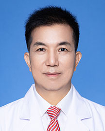

<!-- AUTO-GENERATED-BY: work/generate_obsidian_profiles.py -->

<!-- TEMPLATE: D:\workspace\信息收集整理\医生画像仓库\模板\医生画像模板.md -->

# 梁长虹

## 基础信息

| 字段 | 内容 |
|---|---|
| 姓名 | 梁长虹 |
| 医院 | 广东省人民医院 |
| 科室 | 放射科 |
| 职称/身份 | 主任医师 |
| 来源链接 | [官网原文](https://www.gdghospital.org.cn/Expertlistt/info_itemid_25475_subjectid_64.html) |
| 采集日期 | 2026-08-14 |

## 简介/擅长

腹部疾病和心血管疾病影像诊断，基于医学影像数据挖掘（人工智能）及临床应用研究

## 教育与进修经历

- 现任中国康复医学会医学影像与康复专业委员会主任委员、中国医师协会放射医师分会候任会长、中国医师协会放射医师毕业后继续教育委员会副主任委员、中国医院协会医学影像中心分会副主任委员、中国医学装备协会磁共振应用专业委员会副主任委员；

## 科研项目与成果

- 二级岗主任医师、医学博士、教授、博士生导师、国务院政府特殊津贴专家、国家重点研发计划项目首席科学家、广东省医学领军人才、入选爱思唯尔中国15名顶级放射学专家、广东省人民医院医学影像科主任。
- 主持国家重点研发计划项目、NSFC-广东省联合基金重点项目、国家自然科学基金面上项目、广东省科技计划项目等国家级、省厅级课题13项，获广东省科技进步奖一等奖、教育部科学技术进步奖二等奖等9项科技奖励；
- 获授权发明专利19项，实用新型专利4项，计算机软件著作权登记17项；

## 论文与学术产出

- 以第一作者和通讯作者身份在国际重要期刊上发表SCI论文100余篇，单篇最高被引用次数达1800余次；
- 获授权发明专利19项，实用新型专利4项，计算机软件著作权登记17项；
- 主编或主译著作11部，其中包括研究生教材。
- 历任亚洲腹部放射学会主席、中华医学会放射学分会副主任委员、广东省医学会放射医学分会主任委员、广东省医师协会放射科医师分会主任委员，并担任中华放射学杂志等多家学术期刊副主编。

## 可包装亮点

- 二级岗主任医师、医学博士、教授、博士生导师、国务院政府特殊津贴专家、国家重点研发计划项目首席科学家、广东省医学领军人才、入选爱思唯尔中国15名顶级放射学专家、广东省人民医院医学影像科主任。
- 以第一作者和通讯作者身份在国际重要期刊上发表SCI论文100余篇，单篇最高被引用次数达1800余次；
- 主持国家重点研发计划项目、NSFC-广东省联合基金重点项目、国家自然科学基金面上项目、广东省科技计划项目等国家级、省厅级课题13项，获广东省科技进步奖一等奖、教育部科学技术进步奖二等奖等9项科技奖励；
- 获授权发明专利19项，实用新型专利4项，计算机软件著作权登记17项；

## 重点疾病/人群标签

- 慢性病：
- 肿瘤：
- 生殖疾病：
- 免疫/风湿：
- 术后恢复/康复：康复
- 疑难重症：

## 证据摘录

> 只摘录官网公开信息中的短句或关键字段，不复制大段原文。

- 官网身份字段：主任医师
- 官网简介/擅长：腹部疾病和心血管疾病影像诊断，基于医学影像数据挖掘（人工智能）及临床应用研究
- 官网亮眼经历线索：二级岗主任医师、医学博士、教授、博士生导师、国务院政府特殊津贴专家、国家重点研发计划项目首席科学家、广东省医学领军人才、入选爱思唯尔中国15名顶级放射学专家、广东省人民医院医学影像科主任。 以第一作者和通讯作者身份在国际重要期刊上发表SCI论文100余篇，单篇最高被引用次数达1800余次； 主持国家重点研发计划项目、NSFC-广东省联合基金重点项目、国家自然科学基金面上项目、广东省科技计划项目等国家级、省厅级课题13项，获广东省科技进…
- 来源链接：https://www.gdghospital.org.cn/Expertlistt/info_itemid_25475_subjectid_64.html

## BD 画像摘要

梁长虹医生可作为术后恢复/康复方向的基础画像候选。后续 BD 使用应继续以官网来源和人工复核为准，不添加疗效承诺或无来源包装。

## 合规边界

- 仅使用医院官网、官方公众号、官方小程序等公开渠道。
- 不采集私人电话、私人微信、家庭住址、患者隐私或非公开排班信息。
- 不写“保证治愈”“疗效第一”“包治疑难杂症”等无法由官网证明的表述。
