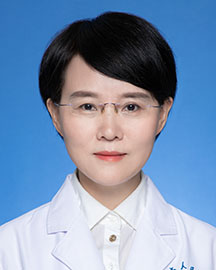

<!-- AUTO-GENERATED-BY: work/generate_obsidian_profiles.py -->

<!-- TEMPLATE: D:\workspace\信息收集整理\医生画像仓库\模板\医生画像模板.md -->

# 梅平

## 基础信息

| 字段 | 内容 |
|---|---|
| 姓名 | 梅平 |
| 医院 | 广东省人民医院 |
| 科室 | 病理科 |
| 职称/身份 | 主任医师 |
| 来源链接 | [官网原文](https://www.gdghospital.org.cn/Expertlistt/info_itemid_25298_subjectid_59.html) |
| 采集日期 | 2026-08-14 |

## 简介/擅长

常见疾病病理诊断，专长细胞病理学及妇科病理学，致力于宫颈病变的诊断及研究

## 科研项目与成果

- 国际细胞学会 会员 中华医学会病理学分会第十二届细胞病理学组 副组长 第十三届 顾问 中国医药教育协会细胞病理学专业委员会 副主任委员 中国优生科学协会中国阴道镜与宫颈病理学分会（CSCCP） 常务委员 中国合格评定国家认可委员会（CNAS）医学实验室认可制度 评审员 广东省医学会病理学分会细胞病理学组 组长 广东省基层医药学会细胞病理与分子诊断专委会 副主任委员 中国医师协会妇产科医师分会阴道镜及宫颈病变专业委员会 委员 中华医学会病理学分会国际交流合作工作委员会 委员 广东省妇幼保健协会妇科专业委员会阴道镜和…

## 可包装亮点

- 病理科行政副主任 从事外科病理学诊断工作24年，美国俄亥俄州立大学Wexner医疗中心病理学系访问学习1年。
- 国际细胞学会 会员 中华医学会病理学分会第十二届细胞病理学组 副组长 第十三届 顾问 中国医药教育协会细胞病理学专业委员会 副主任委员 中国优生科学协会中国阴道镜与宫颈病理学分会（CSCCP） 常务委员 中国合格评定国家认可委员会（CNAS）医学实验室认可制度 评审员 广东省医学会病理学分会细胞病理学组 组长 广东省基层医药学会细胞病理与分子诊断专委会 副…

## 重点疾病/人群标签

- 慢性病：
- 肿瘤：癌
- 生殖疾病：
- 免疫/风湿：
- 术后恢复/康复：
- 疑难重症：

## 证据摘录

> 只摘录官网公开信息中的短句或关键字段，不复制大段原文。

- 官网身份字段：主任医师
- 官网简介/擅长：常见疾病病理诊断，专长细胞病理学及妇科病理学，致力于宫颈病变的诊断及研究
- 官网亮眼经历线索：病理科行政副主任 从事外科病理学诊断工作24年，美国俄亥俄州立大学Wexner医疗中心病理学系访问学习1年。 国际细胞学会 会员 中华医学会病理学分会第十二届细胞病理学组 副组长 第十三届 顾问 中国医药教育协会细胞病理学专业委员会 副主任委员 中国优生科学协会中国阴道镜与宫颈病理学分会（CSCCP） 常务委员 中国合格评定国家认可委员会（CNAS）医学实验室认可制度 评审员 广东省医学会病理学分会细胞病理学组 组长 广东省基层医药学…
- 来源链接：https://www.gdghospital.org.cn/Expertlistt/info_itemid_25298_subjectid_59.html

## BD 画像摘要

梅平医生可作为肿瘤方向的基础画像候选。后续 BD 使用应继续以官网来源和人工复核为准，不添加疗效承诺或无来源包装。

## 合规边界

- 仅使用医院官网、官方公众号、官方小程序等公开渠道。
- 不采集私人电话、私人微信、家庭住址、患者隐私或非公开排班信息。
- 不写“保证治愈”“疗效第一”“包治疑难杂症”等无法由官网证明的表述。
