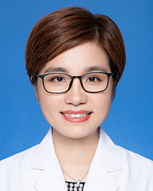

<!-- AUTO-GENERATED-BY: work/generate_obsidian_profiles.py -->

<!-- TEMPLATE: D:\workspace\信息收集整理\医生画像仓库\模板\医生画像模板.md -->

# 欧艳秋

## 基础信息

| 字段 | 内容 |
|---|---|
| 姓名 | 欧艳秋 |
| 医院 | 广东省人民医院 |
| 科室 | 广东省心血管病中心 |
| 职称/身份 | 副研究员 |
| 来源链接 | [官网原文](https://www.gdghospital.org.cn/Expertlistt/info_itemid_56771_subjectid_84.html) |
| 采集日期 | 2026-08-14 |

## 简介/擅长

## 科研项目与成果

- 主持两项国自然基金，3项省自然基金，作为骨干参与了“十三五”、“十四五”等多项国家重点研发项目，共发表文章逾百篇，近3年以第一作者、通讯作者发表文章10余篇。
- 具有丰富的国际交流经验，曾到美国纽约州立大学奥尔巴尼分校、日本北海道大学以及牛津大学等进行访学交流，并多次在国际会议如美国心脏病学会年会ACC、欧洲心脏病学会年会ESC等进行口头或者Moderate poster成果展示。

## 论文与学术产出

- 主持两项国自然基金，3项省自然基金，作为骨干参与了“十三五”、“十四五”等多项国家重点研发项目，共发表文章逾百篇，近3年以第一作者、通讯作者发表文章10余篇。

## 可包装亮点

- 主持两项国自然基金，3项省自然基金，作为骨干参与了“十三五”、“十四五”等多项国家重点研发项目，共发表文章逾百篇，近3年以第一作者、通讯作者发表文章10余篇。
- 获得广东省科技进步一等奖、宋庆龄儿科医学奖等。
- 具有丰富的国际交流经验，曾到美国纽约州立大学奥尔巴尼分校、日本北海道大学以及牛津大学等进行访学交流，并多次在国际会议如美国心脏病学会年会ACC、欧洲心脏病学会年会ESC等进行口头或者Moderate poster成果展示。

## 重点疾病/人群标签

- 慢性病：高血压、慢性
- 肿瘤：
- 生殖疾病：
- 免疫/风湿：
- 术后恢复/康复：
- 疑难重症：

## 证据摘录

> 只摘录官网公开信息中的短句或关键字段，不复制大段原文。

- 官网身份字段：副研究员
- 官网亮眼经历线索：主持两项国自然基金，3项省自然基金，作为骨干参与了“十三五”、“十四五”等多项国家重点研发项目，共发表文章逾百篇，近3年以第一作者、通讯作者发表文章10余篇。 获得广东省科技进步一等奖、宋庆龄儿科医学奖等。 具有丰富的国际交流经验，曾到美国纽约州立大学奥尔巴尼分校、日本北海道大学以及牛津大学等进行访学交流，并多次在国际会议如美国心脏病学会年会ACC、欧洲心脏病学会年会ESC等进行口头或者Moderate poster成果展示。
- 来源链接：https://www.gdghospital.org.cn/Expertlistt/info_itemid_56771_subjectid_84.html

## BD 画像摘要

欧艳秋医生可作为慢性病方向的基础画像候选。后续 BD 使用应继续以官网来源和人工复核为准，不添加疗效承诺或无来源包装。

## 合规边界

- 仅使用医院官网、官方公众号、官方小程序等公开渠道。
- 不采集私人电话、私人微信、家庭住址、患者隐私或非公开排班信息。
- 不写“保证治愈”“疗效第一”“包治疑难杂症”等无法由官网证明的表述。
