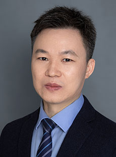

<!-- AUTO-GENERATED-BY: work/generate_obsidian_profiles.py -->

<!-- TEMPLATE: D:\workspace\信息收集整理\医生画像仓库\模板\医生画像模板.md -->

# 欧阳维富

## 基础信息

| 字段 | 内容 |
|---|---|
| 姓名 | 欧阳维富 |
| 医院 | 广东省人民医院 |
| 科室 | 检验科 |
| 职称/身份 | 副主任技师 |
| 来源链接 | [官网原文](https://www.gdghospital.org.cn/Expertlistt/info_itemid_32971_subjectid_60.html) |
| 采集日期 | 2026-08-14 |

## 简介/擅长

## 科研项目与成果

- 参与国家自然科学基金、广东省科技计划项目、广州市科技计划项目、广东省医学科研基金等多项科研项目。
- 围绕医疗卫生体制改革、公共卫生体系构建、卫生健康领域立法等建言献策，多项履职成果获全国政协、九三学社中央等采用。

## 论文与学术产出

- 于《医学与哲学》、《中国医院管理》、《中华高血压杂志》、《南方医科大学学报》、《中华流行病学杂志》、《中华危重病急救医学》、《Bone》、《Osteoporos Int》、《Br J Nutr》等医学期刊发表学术论文多篇。

## 可包装亮点

- 现任九三学社广东省委会参政议政专委会委员、九三学社省直广东省人民医院基层委员会委员、内部监督委员。
- 参与国家自然科学基金、广东省科技计划项目、广州市科技计划项目、广东省医学科研基金等多项科研项目。
- 于《医学与哲学》、《中国医院管理》、《中华高血压杂志》、《南方医科大学学报》、《中华流行病学杂志》、《中华危重病急救医学》、《Bone》、《Osteoporos Int》、《Br J Nutr》等医学期刊发表学术论文多篇。

## 重点疾病/人群标签

- 慢性病：高血压、危重
- 肿瘤：
- 生殖疾病：
- 免疫/风湿：
- 术后恢复/康复：
- 疑难重症：高血压、危重

## 证据摘录

> 只摘录官网公开信息中的短句或关键字段，不复制大段原文。

- 官网身份字段：副主任技师
- 官网亮眼经历线索：现任九三学社广东省委会参政议政专委会委员、九三学社省直广东省人民医院基层委员会委员、内部监督委员。 参与国家自然科学基金、广东省科技计划项目、广州市科技计划项目、广东省医学科研基金等多项科研项目。 于《医学与哲学》、《中国医院管理》、《中华高血压杂志》、《南方医科大学学报》、《中华流行病学杂志》、《中华危重病急救医学》、《Bone》、《Osteoporos Int》、《Br J Nutr》等医学期刊发表学术论文多篇。
- 来源链接：https://www.gdghospital.org.cn/Expertlistt/info_itemid_32971_subjectid_60.html

## BD 画像摘要

欧阳维富医生可作为慢性病、疑难重症方向的基础画像候选。后续 BD 使用应继续以官网来源和人工复核为准，不添加疗效承诺或无来源包装。

## 合规边界

- 仅使用医院官网、官方公众号、官方小程序等公开渠道。
- 不采集私人电话、私人微信、家庭住址、患者隐私或非公开排班信息。
- 不写“保证治愈”“疗效第一”“包治疑难杂症”等无法由官网证明的表述。
