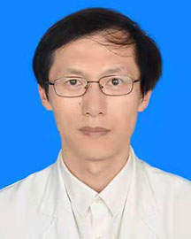

<!-- AUTO-GENERATED-BY: work/generate_obsidian_profiles.py -->

<!-- TEMPLATE: D:\workspace\信息收集整理\医生画像仓库\模板\医生画像模板.md -->

# 段金海

## 基础信息

| 字段 | 内容 |
|---|---|
| 姓名 | 段金海 |
| 医院 | 广东省人民医院 |
| 科室 | 老年神经科 |
| 职称/身份 | 主任医师 |
| 来源链接 | [官网原文](https://www.gdghospital.org.cn/Expertlistt/info_itemid_25122_subjectid_91.html) |
| 采集日期 | 2026-08-14 |

## 简介/擅长

缺血性脑血管病介入治疗技术、痴呆的诊治

## 教育与进修经历

- 简介 ： 医学博士，主任医师，硕士研究生导师，老年神经科行政副主任（主持工作） 老研所第十党支部书记 曾在加拿大McGill大学附属Lady Davis Institute/Jewish General Hospital、Montreal Neurological Hospital及瑞典Karolinska Institute接受阿尔茨海默病和其他痴呆症的诊疗技术培训 学术任职 ： 广东省医学会老年医学分会副主任委员 广东省医学会神经病学分会痴呆学组副组长 中华志愿者协会中西医结合专家委员会老年医学科专业组副组长…

## 可包装亮点

- 简介 ： 医学博士，主任医师，硕士研究生导师，老年神经科行政副主任（主持工作） 老研所第十党支部书记 曾在加拿大McGill大学附属Lady Davis Institute/Jewish General Hospital、Montreal Neurological Hospital及瑞典Karolinska Institute接受阿尔茨海默病和其他痴呆症的…
- 获“第九届羊城好医生”称号。

## 重点疾病/人群标签

- 慢性病：
- 肿瘤：
- 生殖疾病：
- 免疫/风湿：免疫
- 术后恢复/康复：
- 疑难重症：

## 证据摘录

> 只摘录官网公开信息中的短句或关键字段，不复制大段原文。

- 官网身份字段：主任医师
- 官网简介/擅长：缺血性脑血管病介入治疗技术、痴呆的诊治
- 官网亮眼经历线索：简介 ： 医学博士，主任医师，硕士研究生导师，老年神经科行政副主任（主持工作） 老研所第十党支部书记 曾在加拿大McGill大学附属Lady Davis Institute/Jewish General Hospital、Montreal Neurological Hospital及瑞典Karolinska Institute接受阿尔茨海默病和其他痴呆症的诊疗技术培训 学术任职 ： 广东省医学会老年医学分会副主任委员 广东省医学会神经…
- 来源链接：https://www.gdghospital.org.cn/Expertlistt/info_itemid_25122_subjectid_91.html

## BD 画像摘要

段金海医生可作为免疫/风湿/感染方向的基础画像候选。后续 BD 使用应继续以官网来源和人工复核为准，不添加疗效承诺或无来源包装。

## 合规边界

- 仅使用医院官网、官方公众号、官方小程序等公开渠道。
- 不采集私人电话、私人微信、家庭住址、患者隐私或非公开排班信息。
- 不写“保证治愈”“疗效第一”“包治疑难杂症”等无法由官网证明的表述。
