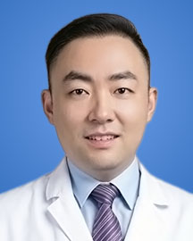

<!-- AUTO-GENERATED-BY: work/generate_obsidian_profiles.py -->

<!-- TEMPLATE: D:\workspace\信息收集整理\医生画像仓库\模板\医生画像模板.md -->

# 殷子

## 基础信息

| 字段 | 内容 |
|---|---|
| 姓名 | 殷子 |
| 医院 | 广东省人民医院 |
| 科室 | 肝胆外科 |
| 职称/身份 | 副主任医师、副研究员 |
| 来源链接 | [官网原文](https://www.gdghospital.org.cn/Expertlistt/info_itemid_32776_subjectid_105.html) |
| 采集日期 | 2026-08-14 |

## 简介/擅长

从事肝胆外科临床与科研十余年，深耕原发性肝癌、肝转移瘤、胆管癌、等疑难肿瘤诊疗，精通精准肝切除、腹腔镜微创外科、恶性肿瘤转化综合治疗等

## 科研项目与成果

- 专长 从事肝胆外科临床与科研十余年，深耕原发性肝癌、肝转移瘤、胆管癌、等疑难肿瘤诊疗，精通精准肝切除、腹腔镜微创外科、恶性肿瘤转化综合治疗等。
- 承担多项国家自然科学基金、广东省自然科学基金等。

## 论文与学术产出

- 以第一/通讯作者在Hepatology、Gut、Journal for Immunotherapy of Cancer、Annals of Surgery等期刊上发表多篇SCI论文。

## 可包装亮点

- 专长 从事肝胆外科临床与科研十余年，深耕原发性肝癌、肝转移瘤、胆管癌、等疑难肿瘤诊疗，精通精准肝切除、腹腔镜微创外科、恶性肿瘤转化综合治疗等。
- 简介 广东省人民医院肝胆外科、肝胆胰精准诊疗中心，医疗组组长。
- 副主任医师、副研究员，硕士研究生导师，中山大学中山医学院临床医学八年制专业。
- 广东省基层医药学会胆道外科专委会常务委员、胰腺神经内分泌瘤专委会委员；

## 重点疾病/人群标签

- 慢性病：
- 肿瘤：肿瘤、癌、瘤、肝癌、疑难
- 生殖疾病：
- 免疫/风湿：
- 术后恢复/康复：
- 疑难重症：肿瘤、癌、瘤、肝癌、疑难

## 证据摘录

> 只摘录官网公开信息中的短句或关键字段，不复制大段原文。

- 官网身份字段：副主任医师、副研究员
- 官网简介/擅长：从事肝胆外科临床与科研十余年，深耕原发性肝癌、肝转移瘤、胆管癌、等疑难肿瘤诊疗，精通精准肝切除、腹腔镜微创外科、恶性肿瘤转化综合治疗等
- 官网亮眼经历线索：专长 从事肝胆外科临床与科研十余年，深耕原发性肝癌、肝转移瘤、胆管癌、等疑难肿瘤诊疗，精通精准肝切除、腹腔镜微创外科、恶性肿瘤转化综合治疗等。 简介 广东省人民医院肝胆外科、肝胆胰精准诊疗中心，医疗组组长。 副主任医师、副研究员，硕士研究生导师，中山大学中山医学院临床医学八年制专业。 广东省基层医药学会胆道外科专委会常务委员、胰腺神经内分泌瘤专委会委员；
- 来源链接：https://www.gdghospital.org.cn/Expertlistt/info_itemid_32776_subjectid_105.html

## BD 画像摘要

殷子医生可作为肿瘤、疑难重症方向的基础画像候选。后续 BD 使用应继续以官网来源和人工复核为准，不添加疗效承诺或无来源包装。

## 合规边界

- 仅使用医院官网、官方公众号、官方小程序等公开渠道。
- 不采集私人电话、私人微信、家庭住址、患者隐私或非公开排班信息。
- 不写“保证治愈”“疗效第一”“包治疑难杂症”等无法由官网证明的表述。
