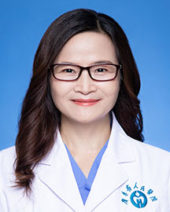

<!-- AUTO-GENERATED-BY: work/generate_obsidian_profiles.py -->

<!-- TEMPLATE: D:\workspace\信息收集整理\医生画像仓库\模板\医生画像模板.md -->

# 江燕萍

## 基础信息

| 字段 | 内容 |
|---|---|
| 姓名 | 江燕萍 |
| 医院 | 广东省人民医院 |
| 科室 | 产科 |
| 职称/身份 | 主任医师 |
| 来源链接 | [官网原文](https://www.gdghospital.org.cn/Expertlistt/info_itemid_24838_subjectid_52.html) |
| 采集日期 | 2026-08-14 |

## 简介/擅长

从事妇产科临床、教学及科研30+年

## 科研项目与成果

- 医疗专长 ： 从事妇产科临床、教学及科研30+年。
- 主持和参与多项省、市级科研基金项目。

## 可包装亮点

- 社会任职 ： 广东省临床医学会胎儿医学专业委员会常务委员 广东省临床医学会母胎医学分会常务委员 广东省医学会医学遗传学分会委员 广东省医学会罕见病学分会委员 广州地区妇女儿童保健专家库孕产妇危急重症专家 广东省医师协会分会产科专业组成员 广东优生优育协会盆底康复与产后保健专业委员会委员 广东省助产协会优生咨询专家 《中山大学学报医学版》、《实用医学杂志》…

## 重点疾病/人群标签

- 慢性病：
- 肿瘤：
- 生殖疾病：
- 免疫/风湿：
- 术后恢复/康复：康复、重症、高危、罕见
- 疑难重症：康复、重症、高危、罕见

## 证据摘录

> 只摘录官网公开信息中的短句或关键字段，不复制大段原文。

- 官网身份字段：主任医师
- 官网简介/擅长：从事妇产科临床、教学及科研30+年
- 官网亮眼经历线索：社会任职 ： 广东省临床医学会胎儿医学专业委员会常务委员 广东省临床医学会母胎医学分会常务委员 广东省医学会医学遗传学分会委员 广东省医学会罕见病学分会委员 广州地区妇女儿童保健专家库孕产妇危急重症专家 广东省医师协会分会产科专业组成员 广东优生优育协会盆底康复与产后保健专业委员会委员 广东省助产协会优生咨询专家 《中山大学学报医学版》、《实用医学杂志》、《CMJ》审稿专家。
- 来源链接：https://www.gdghospital.org.cn/Expertlistt/info_itemid_24838_subjectid_52.html

## BD 画像摘要

江燕萍医生可作为术后恢复/康复、疑难重症方向的基础画像候选。后续 BD 使用应继续以官网来源和人工复核为准，不添加疗效承诺或无来源包装。

## 合规边界

- 仅使用医院官网、官方公众号、官方小程序等公开渠道。
- 不采集私人电话、私人微信、家庭住址、患者隐私或非公开排班信息。
- 不写“保证治愈”“疗效第一”“包治疑难杂症”等无法由官网证明的表述。
