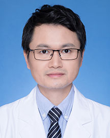

<!-- AUTO-GENERATED-BY: work/generate_obsidian_profiles.py -->

<!-- TEMPLATE: D:\workspace\信息收集整理\医生画像仓库\模板\医生画像模板.md -->

# 江稳强

## 基础信息

| 字段 | 内容 |
|---|---|
| 姓名 | 江稳强 |
| 医院 | 广东省人民医院 |
| 科室 | 急诊科 |
| 职称/身份 | 主任医师 |
| 来源链接 | [官网原文](https://www.gdghospital.org.cn/Expertlistt/info_itemid_33770_subjectid_112.html) |
| 采集日期 | 2026-08-14 |

## 简介/擅长

急诊和重症医学的学科特点和发展趋势

## 科研项目与成果

- 参与国家、省、厅级课题多项，主持省自然科学基金等项目9项，获广东省科学技术奖二等奖1项（排名第二），第一作者/通讯作者在Critical Care等杂志发表学术论文20余篇。

## 论文与学术产出

- 参与国家、省、厅级课题多项，主持省自然科学基金等项目9项，获广东省科学技术奖二等奖1项（排名第二），第一作者/通讯作者在Critical Care等杂志发表学术论文20余篇。

## 可包装亮点

- 广东省人民医院急诊重症监护室副主任（主持工作），医学博士、博士生导师。
- 现任中华医学会急诊医学分会卒中学组委员、中国心胸麻醉学会体外生命支持分会全国委员、中国医师协会心脏重症专委会复苏学组委员、广东省医疗安全协会急诊医学分会主任委员、广东省老年保健协会急危重病专委会副主任委员、广东省生物医学工程学会重症医学工程分会青年委员会副主委、广东省医师协会急诊医师分会秘兼体外生命支持专委会委员、广东省精准医学应用学会急危重症分会委员兼秘…
- 从事急危重症医教研工作20余年，熟悉急诊和重症医学的学科特点和发展趋势。
- 主要研究脓毒症、休克、多器官功能障碍综合征及危重病患者颅内高压相关问题，在ECMO管理、血流动力学监测、机械通气维护及重症患者预后预测研究方面积累了一定的经验。

## 重点疾病/人群标签

- 慢性病：
- 肿瘤：
- 生殖疾病：
- 免疫/风湿：
- 术后恢复/康复：功能障碍、危重、重症、急危重
- 疑难重症：功能障碍、危重、重症、急危重

## 证据摘录

> 只摘录官网公开信息中的短句或关键字段，不复制大段原文。

- 官网身份字段：主任医师
- 官网简介/擅长：急诊和重症医学的学科特点和发展趋势
- 官网亮眼经历线索：广东省人民医院急诊重症监护室副主任（主持工作），医学博士、博士生导师。 现任中华医学会急诊医学分会卒中学组委员、中国心胸麻醉学会体外生命支持分会全国委员、中国医师协会心脏重症专委会复苏学组委员、广东省医疗安全协会急诊医学分会主任委员、广东省老年保健协会急危重病专委会副主任委员、广东省生物医学工程学会重症医学工程分会青年委员会副主委、广东省医师协会急诊医师分会秘兼体外生命支持专委会委员、广东省精准医学应用学会急危重症分会委员兼秘书、广东…
- 来源链接：https://www.gdghospital.org.cn/Expertlistt/info_itemid_33770_subjectid_112.html

## BD 画像摘要

江稳强医生可作为术后恢复/康复、疑难重症方向的基础画像候选。后续 BD 使用应继续以官网来源和人工复核为准，不添加疗效承诺或无来源包装。

## 合规边界

- 仅使用医院官网、官方公众号、官方小程序等公开渠道。
- 不采集私人电话、私人微信、家庭住址、患者隐私或非公开排班信息。
- 不写“保证治愈”“疗效第一”“包治疑难杂症”等无法由官网证明的表述。
