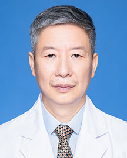

<!-- AUTO-GENERATED-BY: work/generate_obsidian_profiles.py -->

<!-- TEMPLATE: D:\workspace\信息收集整理\医生画像仓库\模板\医生画像模板.md -->

# 江穗

## 基础信息

| 字段 | 内容 |
|---|---|
| 姓名 | 江穗 |
| 医院 | 广东省人民医院 |
| 科室 | 口腔颌面外科 |
| 职称/身份 | 主任医师 |
| 来源链接 | [官网原文](https://www.gdghospital.org.cn/Expertlistt/info_itemid_24959_subjectid_86.html) |
| 采集日期 | 2026-08-14 |

## 简介/擅长

## 科研项目与成果

- 先后获得2项广东省科技计划项目以及1项广东省中医药管理局科研项目， 在国内外期刊发表多篇学术论文。

## 论文与学术产出

- 先后获得2项广东省科技计划项目以及1项广东省中医药管理局科研项目， 在国内外期刊发表多篇学术论文。

## 可包装亮点

- 先后获得2项广东省科技计划项目以及1项广东省中医药管理局科研项目， 在国内外期刊发表多篇学术论文。
- 学术任职： 广东省妇女儿童保健协会口腔卫生专业委员会 副主任委员 广东省医学会颌面头颈外科专业委员会 会员 广东省口腔医学会口腔颌面外科专业委员会 会员

## 重点疾病/人群标签

- 慢性病：
- 肿瘤：肿瘤、癌、复杂
- 生殖疾病：
- 免疫/风湿：
- 术后恢复/康复：
- 疑难重症：肿瘤、癌、复杂

## 证据摘录

> 只摘录官网公开信息中的短句或关键字段，不复制大段原文。

- 官网身份字段：主任医师
- 官网亮眼经历线索：先后获得2项广东省科技计划项目以及1项广东省中医药管理局科研项目， 在国内外期刊发表多篇学术论文。 学术任职： 广东省妇女儿童保健协会口腔卫生专业委员会 副主任委员 广东省医学会颌面头颈外科专业委员会 会员 广东省口腔医学会口腔颌面外科专业委员会 会员
- 来源链接：https://www.gdghospital.org.cn/Expertlistt/info_itemid_24959_subjectid_86.html

## BD 画像摘要

江穗医生可作为肿瘤、疑难重症方向的基础画像候选。后续 BD 使用应继续以官网来源和人工复核为准，不添加疗效承诺或无来源包装。

## 合规边界

- 仅使用医院官网、官方公众号、官方小程序等公开渠道。
- 不采集私人电话、私人微信、家庭住址、患者隐私或非公开排班信息。
- 不写“保证治愈”“疗效第一”“包治疑难杂症”等无法由官网证明的表述。
