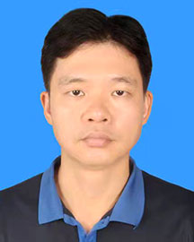

<!-- AUTO-GENERATED-BY: work/generate_obsidian_profiles.py -->

<!-- TEMPLATE: D:\workspace\信息收集整理\医生画像仓库\模板\医生画像模板.md -->

# 沈俊辉

## 基础信息

| 字段 | 内容 |
|---|---|
| 姓名 | 沈俊辉 |
| 医院 | 广东省人民医院 |
| 科室 | 康复医学科 |
| 职称/身份 | 主治医师 |
| 来源链接 | [官网原文](https://www.gdghospital.org.cn/Expertlistt/info_itemid_34148_subjectid_97.html) |
| 采集日期 | 2026-08-14 |

## 简介/擅长

颈肩腰腿痛、肩周炎、足跟痛等慢性疼痛疾病的诊疗，应用中西医结合的理念和方法，开展韧针松解、关节腔注射、物理治疗等精准、安全的疼痛治疗技术

## 教育与进修经历

- 医学博士，曾在广州医科大学附属第二医院疼痛科进修学习。

## 科研项目与成果

- 发表SCI 期刊论文6篇，主持或参与多项国家级和市级课题。

## 论文与学术产出

- 发表SCI 期刊论文6篇，主持或参与多项国家级和市级课题。

## 可包装亮点

- 医学博士，曾在广州医科大学附属第二医院疼痛科进修学习。
- 长期从事疼痛康复工作，擅长颈肩腰腿痛、肩周炎、足跟痛等慢性疼痛疾病的诊疗，应用中西医结合的理念和方法，开展韧针松解、关节腔注射、物理治疗等精准、安全的疼痛治疗技术。
- 发表SCI 期刊论文6篇，主持或参与多项国家级和市级课题。

## 重点疾病/人群标签

- 慢性病：慢性、康复、疼痛
- 肿瘤：
- 生殖疾病：
- 免疫/风湿：
- 术后恢复/康复：慢性、康复、疼痛
- 疑难重症：

## 证据摘录

> 只摘录官网公开信息中的短句或关键字段，不复制大段原文。

- 官网身份字段：主治医师
- 官网简介/擅长：颈肩腰腿痛、肩周炎、足跟痛等慢性疼痛疾病的诊疗，应用中西医结合的理念和方法，开展韧针松解、关节腔注射、物理治疗等精准、安全的疼痛治疗技术
- 官网亮眼经历线索：医学博士，曾在广州医科大学附属第二医院疼痛科进修学习。 长期从事疼痛康复工作，擅长颈肩腰腿痛、肩周炎、足跟痛等慢性疼痛疾病的诊疗，应用中西医结合的理念和方法，开展韧针松解、关节腔注射、物理治疗等精准、安全的疼痛治疗技术。 发表SCI 期刊论文6篇，主持或参与多项国家级和市级课题。
- 来源链接：https://www.gdghospital.org.cn/Expertlistt/info_itemid_34148_subjectid_97.html

## BD 画像摘要

沈俊辉医生可作为慢性病、术后恢复/康复方向的基础画像候选。后续 BD 使用应继续以官网来源和人工复核为准，不添加疗效承诺或无来源包装。

## 合规边界

- 仅使用医院官网、官方公众号、官方小程序等公开渠道。
- 不采集私人电话、私人微信、家庭住址、患者隐私或非公开排班信息。
- 不写“保证治愈”“疗效第一”“包治疑难杂症”等无法由官网证明的表述。
