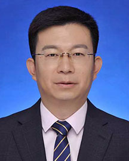

<!-- AUTO-GENERATED-BY: work/generate_obsidian_profiles.py -->

<!-- TEMPLATE: D:\workspace\信息收集整理\医生画像仓库\模板\医生画像模板.md -->

# 沈柱

## 基础信息

| 字段 | 内容 |
|---|---|
| 姓名 | 沈柱 |
| 医院 | 广东省人民医院 |
| 科室 | 皮肤性病科 |
| 职称/身份 | 主任医师 科主任 |
| 来源链接 | [官网原文](https://www.gdghospital.org.cn/Expertlistt/info_itemid_34870_subjectid_22.html) |
| 采集日期 | 2026-08-14 |

## 简介/擅长

## 教育与进修经历

- 教授，博士生导师，留美博士后，皮肤科行政主任 入选国家高层人才计划 解放军三星人才“科技新星”荣誉称号 四川省学术和技术带头人 四川省卫生健康领军人才 中华医学会皮肤性病学分会银屑病研究中心专家 中国医师协会皮肤科医师分会罕见遗传病专委会副主任委员 中国中西医结合学会变态反应专委会委员 长期从事银屑病（牛皮癣）、特应性皮炎（湿疹）、皮肤感染、罕见/疑难皮肤病的诊治研究。

## 科研项目与成果

- 作为负责人，主持5项国家自然科学基金，第一/通讯作者在《新英格兰医学杂志》等发表SCI论文30余篇。

## 论文与学术产出

- 作为负责人，主持5项国家自然科学基金，第一/通讯作者在《新英格兰医学杂志》等发表SCI论文30余篇。

## 可包装亮点

- 教授，博士生导师，留美博士后，皮肤科行政主任 入选国家高层人才计划 解放军三星人才“科技新星”荣誉称号 四川省学术和技术带头人 四川省卫生健康领军人才 中华医学会皮肤性病学分会银屑病研究中心专家 中国医师协会皮肤科医师分会罕见遗传病专委会副主任委员 中国中西医结合学会变态反应专委会委员 长期从事银屑病（牛皮癣）、特应性皮炎（湿疹）、皮肤感染、罕见/疑难皮肤…
- 作为负责人，主持5项国家自然科学基金，第一/通讯作者在《新英格兰医学杂志》等发表SCI论文30余篇。

## 重点疾病/人群标签

- 慢性病：
- 肿瘤：
- 生殖疾病：
- 免疫/风湿：感染、疑难、罕见
- 术后恢复/康复：
- 疑难重症：感染、疑难、罕见

## 证据摘录

> 只摘录官网公开信息中的短句或关键字段，不复制大段原文。

- 官网身份字段：主任医师 科主任
- 官网亮眼经历线索：教授，博士生导师，留美博士后，皮肤科行政主任 入选国家高层人才计划 解放军三星人才“科技新星”荣誉称号 四川省学术和技术带头人 四川省卫生健康领军人才 中华医学会皮肤性病学分会银屑病研究中心专家 中国医师协会皮肤科医师分会罕见遗传病专委会副主任委员 中国中西医结合学会变态反应专委会委员 长期从事银屑病（牛皮癣）、特应性皮炎（湿疹）、皮肤感染、罕见/疑难皮肤病的诊治研究。 作为负责人，主持5项国家自然科学基金，第一/通讯作者在《新英格兰…
- 来源链接：https://www.gdghospital.org.cn/Expertlistt/info_itemid_34870_subjectid_22.html

## BD 画像摘要

沈柱医生可作为免疫/风湿/感染、疑难重症方向的基础画像候选。后续 BD 使用应继续以官网来源和人工复核为准，不添加疗效承诺或无来源包装。

## 合规边界

- 仅使用医院官网、官方公众号、官方小程序等公开渠道。
- 不采集私人电话、私人微信、家庭住址、患者隐私或非公开排班信息。
- 不写“保证治愈”“疗效第一”“包治疑难杂症”等无法由官网证明的表述。
