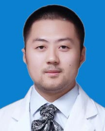

<!-- AUTO-GENERATED-BY: work/generate_obsidian_profiles.py -->

<!-- TEMPLATE: D:\workspace\信息收集整理\医生画像仓库\模板\医生画像模板.md -->

# 洪亮

## 基础信息

| 字段 | 内容 |
|---|---|
| 姓名 | 洪亮 |
| 医院 | 广东省人民医院 |
| 科室 | 心外科 |
| 职称/身份 | 主治医师 |
| 来源链接 | [官网原文](https://www.gdghospital.org.cn/Expertlistt/info_itemid_47175_subjectid_80.html) |
| 采集日期 | 2026-08-14 |

## 简介/擅长

方向，曾前往瑞典进修学习，并于美国Marshall大学研究深造，深入研究成人瓣膜、冠心病及先心病外科疾病，同时参与多项科研项目和临床研究，致力于以临床疾病为核心、与科研结合的心脏外科疾病诊治

## 教育与进修经历

- 研究生期间以微创手术、大血管疾病、先天性心脏病为研究课题和主攻方向，曾前往瑞典进修学习，并于美国Marshall大学研究深造，深入研究成人瓣膜、冠心病及先心病外科疾病，同时参与多项科研项目和临床研究，致力于以临床疾病为核心、与科研结合的心脏外科疾病诊治。

## 科研项目与成果

- 研究生期间以微创手术、大血管疾病、先天性心脏病为研究课题和主攻方向，曾前往瑞典进修学习，并于美国Marshall大学研究深造，深入研究成人瓣膜、冠心病及先心病外科疾病，同时参与多项科研项目和临床研究，致力于以临床疾病为核心、与科研结合的心脏外科疾病诊治。

## 可包装亮点

- 研究生期间以微创手术、大血管疾病、先天性心脏病为研究课题和主攻方向，曾前往瑞典进修学习，并于美国Marshall大学研究深造，深入研究成人瓣膜、冠心病及先心病外科疾病，同时参与多项科研项目和临床研究，致力于以临床疾病为核心、与科研结合的心脏外科疾病诊治。

## 重点疾病/人群标签

- 慢性病：冠心病
- 肿瘤：
- 生殖疾病：
- 免疫/风湿：
- 术后恢复/康复：
- 疑难重症：

## 证据摘录

> 只摘录官网公开信息中的短句或关键字段，不复制大段原文。

- 官网身份字段：主治医师
- 官网简介/擅长：方向，曾前往瑞典进修学习，并于美国Marshall大学研究深造，深入研究成人瓣膜、冠心病及先心病外科疾病，同时参与多项科研项目和临床研究，致力于以临床疾病为核心、与科研结合的心脏外科疾病诊治
- 官网亮眼经历线索：研究生期间以微创手术、大血管疾病、先天性心脏病为研究课题和主攻方向，曾前往瑞典进修学习，并于美国Marshall大学研究深造，深入研究成人瓣膜、冠心病及先心病外科疾病，同时参与多项科研项目和临床研究，致力于以临床疾病为核心、与科研结合的心脏外科疾病诊治。
- 来源链接：https://www.gdghospital.org.cn/Expertlistt/info_itemid_47175_subjectid_80.html

## BD 画像摘要

洪亮医生可作为慢性病方向的基础画像候选。后续 BD 使用应继续以官网来源和人工复核为准，不添加疗效承诺或无来源包装。

## 合规边界

- 仅使用医院官网、官方公众号、官方小程序等公开渠道。
- 不采集私人电话、私人微信、家庭住址、患者隐私或非公开排班信息。
- 不写“保证治愈”“疗效第一”“包治疑难杂症”等无法由官网证明的表述。
