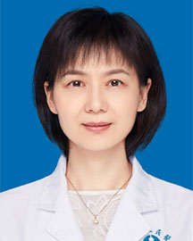

<!-- AUTO-GENERATED-BY: work/generate_obsidian_profiles.py -->

<!-- TEMPLATE: D:\workspace\信息收集整理\医生画像仓库\模板\医生画像模板.md -->

# 涂海燕

## 基础信息

| 字段 | 内容 |
|---|---|
| 姓名 | 涂海燕 |
| 医院 | 广东省人民医院 |
| 科室 | 肺内三科 |
| 职称/身份 | 主任医师 科主任 |
| 来源链接 | [官网原文](https://www.gdghospital.org.cn/Expertlistt/info_itemid_24317_subjectid_27.html) |
| 采集日期 | 2026-08-14 |

## 简介/擅长

领域：以靶向治疗、免疫治疗为主的肺癌精准治疗，新药临床试验，HER2阳性肺癌，科研论文：包括以第一或者共同第一作者的论文发表在Nature Medicine, Annals of Oncology, European Journal of Cancer, Molecular Oncology, Lung cancer, 单篇最高影响因子82.9分

## 教育与进修经历

- 肿瘤学博士，主任医师，硕士生导师 广东省人民医院肿瘤医院肺内三科主任 美国纪念斯隆凯瑟琳癌症中心访问学者 广东省医疗行业协会肺部肿瘤管理分会主任委员 广东省女医师协会肺癌专业委员会主任委员 广东省医师协会肿瘤重症分会副主任委员 广东省临床医学会真实世界研究专委会副主任委员 广东省临床医学学会肿瘤支持与康复治疗专业委员会副主任委员 广州抗癌协会肺癌专委会副主任委员 擅长领域：以靶向治疗、免疫治疗为主的肺癌精准治疗，新药临床试验，HER2阳性肺癌，科研论文：包括以第一或者共同第一作者的论文发表在Nature Medi…

## 科研项目与成果

- 肿瘤学博士，主任医师，硕士生导师 广东省人民医院肿瘤医院肺内三科主任 美国纪念斯隆凯瑟琳癌症中心访问学者 广东省医疗行业协会肺部肿瘤管理分会主任委员 广东省女医师协会肺癌专业委员会主任委员 广东省医师协会肿瘤重症分会副主任委员 广东省临床医学会真实世界研究专委会副主任委员 广东省临床医学学会肿瘤支持与康复治疗专业委员会副主任委员 广州抗癌协会肺癌专委会副主任委员 擅长领域：以靶向治疗、免疫治疗为主的肺癌精准治疗，新药临床试验，HER2阳性肺癌，科研论文：包括以第一或者共同第一作者的论文发表在Nature Medi…

## 论文与学术产出

- 肿瘤学博士，主任医师，硕士生导师 广东省人民医院肿瘤医院肺内三科主任 美国纪念斯隆凯瑟琳癌症中心访问学者 广东省医疗行业协会肺部肿瘤管理分会主任委员 广东省女医师协会肺癌专业委员会主任委员 广东省医师协会肿瘤重症分会副主任委员 广东省临床医学会真实世界研究专委会副主任委员 广东省临床医学学会肿瘤支持与康复治疗专业委员会副主任委员 广州抗癌协会肺癌专委会副主任委员 擅长领域：以靶向治疗、免疫治疗为主的肺癌精准治疗，新药临床试验，HER2阳性肺癌，科研论文：包括以第一或者共同第一作者的论文发表在Nature Medi…

## 可包装亮点

- 肿瘤学博士，主任医师，硕士生导师 广东省人民医院肿瘤医院肺内三科主任 美国纪念斯隆凯瑟琳癌症中心访问学者 广东省医疗行业协会肺部肿瘤管理分会主任委员 广东省女医师协会肺癌专业委员会主任委员 广东省医师协会肿瘤重症分会副主任委员 广东省临床医学会真实世界研究专委会副主任委员 广东省临床医学学会肿瘤支持与康复治疗专业委员会副主任委员 广州抗癌协会肺癌专委会副主…

## 重点疾病/人群标签

- 慢性病：
- 肿瘤：肿瘤、癌、靶向、肺癌、免疫、康复、重症
- 生殖疾病：
- 免疫/风湿：肿瘤、癌、靶向、肺癌、免疫、康复、重症
- 术后恢复/康复：肿瘤、癌、靶向、肺癌、免疫、康复、重症
- 疑难重症：肿瘤、癌、靶向、肺癌、免疫、康复、重症

## 证据摘录

> 只摘录官网公开信息中的短句或关键字段，不复制大段原文。

- 官网身份字段：主任医师 科主任
- 官网简介/擅长：领域：以靶向治疗、免疫治疗为主的肺癌精准治疗，新药临床试验，HER2阳性肺癌，科研论文：包括以第一或者共同第一作者的论文发表在Nature Medicine, Annals of Oncology, European Journal of Cancer, Molecular Oncology, Lung cancer, 单篇最高影响因子82.9分
- 官网亮眼经历线索：肿瘤学博士，主任医师，硕士生导师 广东省人民医院肿瘤医院肺内三科主任 美国纪念斯隆凯瑟琳癌症中心访问学者 广东省医疗行业协会肺部肿瘤管理分会主任委员 广东省女医师协会肺癌专业委员会主任委员 广东省医师协会肿瘤重症分会副主任委员 广东省临床医学会真实世界研究专委会副主任委员 广东省临床医学学会肿瘤支持与康复治疗专业委员会副主任委员 广州抗癌协会肺癌专委会副主任委员 擅长领域：以靶向治疗、免疫治疗为主的肺癌精准治疗，新药临床试验，HER2…
- 来源链接：https://www.gdghospital.org.cn/Expertlistt/info_itemid_24317_subjectid_27.html

## BD 画像摘要

涂海燕医生可作为肿瘤、免疫/风湿/感染、术后恢复/康复、疑难重症方向的基础画像候选。后续 BD 使用应继续以官网来源和人工复核为准，不添加疗效承诺或无来源包装。

## 合规边界

- 仅使用医院官网、官方公众号、官方小程序等公开渠道。
- 不采集私人电话、私人微信、家庭住址、患者隐私或非公开排班信息。
- 不写“保证治愈”“疗效第一”“包治疑难杂症”等无法由官网证明的表述。
