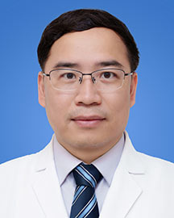

<!-- AUTO-GENERATED-BY: work/generate_obsidian_profiles.py -->

<!-- TEMPLATE: D:\workspace\信息收集整理\医生画像仓库\模板\医生画像模板.md -->

# 温星桥

## 基础信息

| 字段 | 内容 |
|---|---|
| 姓名 | 温星桥 |
| 医院 | 广东省人民医院 |
| 科室 | 泌尿外科 |
| 职称/身份 | 主任医师 科副主任 |
| 来源链接 | [官网原文](https://www.gdghospital.org.cn/Expertlistt/info_itemid_47210_subjectid_7.html) |
| 采集日期 | 2026-08-14 |

## 简介/擅长

熟悉各类泌尿外科疾病，如前列腺、肾、肾上腺、膀胱、输尿管、尿道疾病，泌尿系肿瘤、泌尿系结石症的诊断与治疗，熟练开展开放与微创手术，如各类机器人手术、腹腔镜、前列腺电切镜、经皮肾镜、输尿管镜、膀胱镜手术等

## 教育与进修经历

- 主任医师，教授，博士生导师、博士后合作导师，广东省人民医院高层次引进人才。
- 美国哈佛大学、罗彻斯特大学访问学者。

## 科研项目与成果

- 发表高水平论文多篇，受邀担任国家自然科学基金、省部级基金评审专家，多家国际、国内期刊审稿专家，参与获得广东省科学技术奖、教育部科学技术奖。

## 论文与学术产出

- 发表高水平论文多篇，受邀担任国家自然科学基金、省部级基金评审专家，多家国际、国内期刊审稿专家，参与获得广东省科学技术奖、教育部科学技术奖。

## 可包装亮点

- 主任医师，教授，博士生导师、博士后合作导师，广东省人民医院高层次引进人才。
- 教育部新世纪优秀人才，广东省杰出青年医学人才，广东省千百十人才工程培养对象。
- 美国哈佛大学、罗彻斯特大学访问学者。
- 发表高水平论文多篇，受邀担任国家自然科学基金、省部级基金评审专家，多家国际、国内期刊审稿专家，参与获得广东省科学技术奖、教育部科学技术奖。

## 重点疾病/人群标签

- 慢性病：
- 肿瘤：肿瘤、癌、生殖
- 生殖疾病：肿瘤、癌、生殖
- 免疫/风湿：
- 术后恢复/康复：
- 疑难重症：

## 证据摘录

> 只摘录官网公开信息中的短句或关键字段，不复制大段原文。

- 官网身份字段：主任医师 科副主任
- 官网简介/擅长：熟悉各类泌尿外科疾病，如前列腺、肾、肾上腺、膀胱、输尿管、尿道疾病，泌尿系肿瘤、泌尿系结石症的诊断与治疗，熟练开展开放与微创手术，如各类机器人手术、腹腔镜、前列腺电切镜、经皮肾镜、输尿管镜、膀胱镜手术等
- 官网亮眼经历线索：主任医师，教授，博士生导师、博士后合作导师，广东省人民医院高层次引进人才。 教育部新世纪优秀人才，广东省杰出青年医学人才，广东省千百十人才工程培养对象。 美国哈佛大学、罗彻斯特大学访问学者。 发表高水平论文多篇，受邀担任国家自然科学基金、省部级基金评审专家，多家国际、国内期刊审稿专家，参与获得广东省科学技术奖、教育部科学技术奖。
- 来源链接：https://www.gdghospital.org.cn/Expertlistt/info_itemid_47210_subjectid_7.html

## BD 画像摘要

温星桥医生可作为肿瘤、生殖疾病方向的基础画像候选。后续 BD 使用应继续以官网来源和人工复核为准，不添加疗效承诺或无来源包装。

## 合规边界

- 仅使用医院官网、官方公众号、官方小程序等公开渠道。
- 不采集私人电话、私人微信、家庭住址、患者隐私或非公开排班信息。
- 不写“保证治愈”“疗效第一”“包治疑难杂症”等无法由官网证明的表述。
