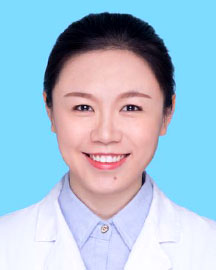

<!-- AUTO-GENERATED-BY: work/generate_obsidian_profiles.py -->

<!-- TEMPLATE: D:\workspace\信息收集整理\医生画像仓库\模板\医生画像模板.md -->

# 温灵珠

## 基础信息

| 字段 | 内容 |
|---|---|
| 姓名 | 温灵珠 |
| 医院 | 广东省人民医院 |
| 科室 | 乳腺科 |
| 职称/身份 | 主治医师 |
| 来源链接 | [官网原文](https://www.gdghospital.org.cn/Expertlistt/info_itemid_32877_subjectid_29.html) |
| 采集日期 | 2026-08-14 |

## 简介/擅长

乳腺癌多学科综合治疗

## 教育与进修经历

- 硕士 中国女医师协会乳腺研究中心青年委员会委员 广州市抗癌协会乳腺癌专业委员会委员 广州市抗癌协会肿瘤分子生物学委员会委员 中国整形美容协会乳房整形分会委员 2014年HELSINK UNIVERSITY CENTRAL HOSPITAL学习 南方医科大学硕士毕业，师从乳腺科行政主任廖宁教授，在廖宁教授的指导下，掌握乳腺科常见疾病的诊治规范，熟悉乳腺癌多学科综合治疗。

## 可包装亮点

- 硕士 中国女医师协会乳腺研究中心青年委员会委员 广州市抗癌协会乳腺癌专业委员会委员 广州市抗癌协会肿瘤分子生物学委员会委员 中国整形美容协会乳房整形分会委员 2014年HELSINK UNIVERSITY CENTRAL HOSPITAL学习 南方医科大学硕士毕业，师从乳腺科行政主任廖宁教授，在廖宁教授的指导下，掌握乳腺科常见疾病的诊治规范，熟悉乳腺癌多学…

## 重点疾病/人群标签

- 慢性病：
- 肿瘤：肿瘤、癌、乳腺癌、多学科
- 生殖疾病：
- 免疫/风湿：
- 术后恢复/康复：
- 疑难重症：肿瘤、癌、乳腺癌、多学科

## 证据摘录

> 只摘录官网公开信息中的短句或关键字段，不复制大段原文。

- 官网身份字段：主治医师
- 官网简介/擅长：乳腺癌多学科综合治疗
- 官网亮眼经历线索：硕士 中国女医师协会乳腺研究中心青年委员会委员 广州市抗癌协会乳腺癌专业委员会委员 广州市抗癌协会肿瘤分子生物学委员会委员 中国整形美容协会乳房整形分会委员 2014年HELSINK UNIVERSITY CENTRAL HOSPITAL学习 南方医科大学硕士毕业，师从乳腺科行政主任廖宁教授，在廖宁教授的指导下，掌握乳腺科常见疾病的诊治规范，熟悉乳腺癌多学科综合治疗。
- 来源链接：https://www.gdghospital.org.cn/Expertlistt/info_itemid_32877_subjectid_29.html

## BD 画像摘要

温灵珠医生可作为肿瘤、疑难重症方向的基础画像候选。后续 BD 使用应继续以官网来源和人工复核为准，不添加疗效承诺或无来源包装。

## 合规边界

- 仅使用医院官网、官方公众号、官方小程序等公开渠道。
- 不采集私人电话、私人微信、家庭住址、患者隐私或非公开排班信息。
- 不写“保证治愈”“疗效第一”“包治疑难杂症”等无法由官网证明的表述。
