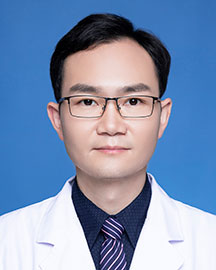

<!-- AUTO-GENERATED-BY: work/generate_obsidian_profiles.py -->

<!-- TEMPLATE: D:\workspace\信息收集整理\医生画像仓库\模板\医生画像模板.md -->

# 滕云

## 基础信息

| 字段 | 内容 |
|---|---|
| 姓名 | 滕云 |
| 医院 | 广东省人民医院 |
| 科室 | 心外科 |
| 职称/身份 | 副主任医师 |
| 来源链接 | [官网原文](https://www.gdghospital.org.cn/Expertlistt/info_itemid_24380_subjectid_80.html) |
| 采集日期 | 2026-08-14 |

## 简介/擅长

冠心病、瓣膜疾病及成人先心病的胸腔镜微创及外科治疗 简介 瓣膜及冠心病外科副主任医师，医学博士，现任心外科手术组组长 从事心血管外科临床工作十余年，瑞典林雪平大学心脏中心访问学者，发表SCI、中文核心文章多篇 荣誉 2018年手术技能大赛全国冠军 2019-2020年优秀援疆干部（自治区），记功一次 2021第七届羊城“青年好医生” 学会任职 广东省医疗安全协会结构性心脏病诊疗安全委员会 副主任委员 国家心血管病专家委员会微创心血管外科专业委员会青年委员 广东省医学会心血管外科分会青年委员 广东省医院协会心脏血管微创外科管理专业委员会委员委员 中国研究型医院学会孕产期母儿心脏病专业委员会委员

## 教育与进修经历

- 特长 擅长冠心病、瓣膜疾病及成人先心病的胸腔镜微创及外科治疗 简介 瓣膜及冠心病外科副主任医师，医学博士，现任心外科手术组组长 从事心血管外科临床工作十余年，瑞典林雪平大学心脏中心访问学者，发表SCI、中文核心文章多篇 荣誉 2018年手术技能大赛全国冠军 2019-2020年优秀援疆干部（自治区），记功一次 2021第七届羊城“青年好医生” 学会任职 广东省医疗安全协会结构性心脏病诊疗安全委员会 副主任委员 国家心血管病专家委员会微创心血管外科专业委员会青年委员 广东省医学会心血管外科分会青年委员 广东省医院协…

## 论文与学术产出

- 特长 擅长冠心病、瓣膜疾病及成人先心病的胸腔镜微创及外科治疗 简介 瓣膜及冠心病外科副主任医师，医学博士，现任心外科手术组组长 从事心血管外科临床工作十余年，瑞典林雪平大学心脏中心访问学者，发表SCI、中文核心文章多篇 荣誉 2018年手术技能大赛全国冠军 2019-2020年优秀援疆干部（自治区），记功一次 2021第七届羊城“青年好医生” 学会任职 广东省医疗安全协会结构性心脏病诊疗安全委员会 副主任委员 国家心血管病专家委员会微创心血管外科专业委员会青年委员 广东省医学会心血管外科分会青年委员 广东省医院协…

## 可包装亮点

- 特长 擅长冠心病、瓣膜疾病及成人先心病的胸腔镜微创及外科治疗 简介 瓣膜及冠心病外科副主任医师，医学博士，现任心外科手术组组长 从事心血管外科临床工作十余年，瑞典林雪平大学心脏中心访问学者，发表SCI、中文核心文章多篇 荣誉 2018年手术技能大赛全国冠军 2019-2020年优秀援疆干部（自治区），记功一次 2021第七届羊城“青年好医生” 学会任职 广…

## 重点疾病/人群标签

- 慢性病：冠心病
- 肿瘤：
- 生殖疾病：
- 免疫/风湿：
- 术后恢复/康复：
- 疑难重症：

## 证据摘录

> 只摘录官网公开信息中的短句或关键字段，不复制大段原文。

- 官网身份字段：副主任医师
- 官网简介/擅长：冠心病、瓣膜疾病及成人先心病的胸腔镜微创及外科治疗 简介 瓣膜及冠心病外科副主任医师，医学博士，现任心外科手术组组长 从事心血管外科临床工作十余年，瑞典林雪平大学心脏中心访问学者，发表SCI、中文核心文章多篇 荣誉 2018年手术技能大赛全国冠军 2019-2020年优秀援疆干部（自治区），记功一次 2021第七届羊城“青年好医生” 学会任职 广东省医疗安全协会结构性心脏病诊疗安全委员会 副主任委员 国家心血管病专家委员会微创心血管外…
- 官网亮眼经历线索：特长 擅长冠心病、瓣膜疾病及成人先心病的胸腔镜微创及外科治疗 简介 瓣膜及冠心病外科副主任医师，医学博士，现任心外科手术组组长 从事心血管外科临床工作十余年，瑞典林雪平大学心脏中心访问学者，发表SCI、中文核心文章多篇 荣誉 2018年手术技能大赛全国冠军 2019-2020年优秀援疆干部（自治区），记功一次 2021第七届羊城“青年好医生” 学会任职 广东省医疗安全协会结构性心脏病诊疗安全委员会 副主任委员 国家心血管病专家委员会微…
- 来源链接：https://www.gdghospital.org.cn/Expertlistt/info_itemid_24380_subjectid_80.html

## BD 画像摘要

滕云医生可作为慢性病方向的基础画像候选。后续 BD 使用应继续以官网来源和人工复核为准，不添加疗效承诺或无来源包装。

## 合规边界

- 仅使用医院官网、官方公众号、官方小程序等公开渠道。
- 不采集私人电话、私人微信、家庭住址、患者隐私或非公开排班信息。
- 不写“保证治愈”“疗效第一”“包治疑难杂症”等无法由官网证明的表述。
