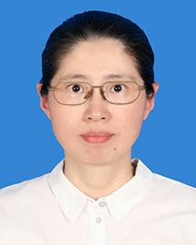

<!-- AUTO-GENERATED-BY: work/generate_obsidian_profiles.py -->

<!-- TEMPLATE: D:\workspace\信息收集整理\医生画像仓库\模板\医生画像模板.md -->

# 牛会林

## 基础信息

| 字段 | 内容 |
|---|---|
| 姓名 | 牛会林 |
| 医院 | 广东省人民医院 |
| 科室 | 病理科 |
| 职称/身份 | 主任医师 |
| 来源链接 | [官网原文](https://www.gdghospital.org.cn/Expertlistt/info_itemid_55552_subjectid_59.html) |
| 采集日期 | 2026-08-14 |

## 简介/擅长

儿童母细胞肿瘤、儿童中枢神经系统肿瘤、性发育异常性腺诊断、胎儿及儿童尸体解剖等的病理诊断

## 教育与进修经历

- 病理学博士，美国宾夕法尼亚大学医院检验与病理系访问学者。

## 科研项目与成果

- 以第一作者及通讯作者发表论文二十余篇，主持并参与多项科研课题。

## 论文与学术产出

- 以第一作者及通讯作者发表论文二十余篇，主持并参与多项科研课题。

## 可包装亮点

- 病理学博士，美国宾夕法尼亚大学医院检验与病理系访问学者。
- 以第一作者及通讯作者发表论文二十余篇，主持并参与多项科研课题。
- 广东省精准医学应用学会分子病理学分会常委兼秘书；
- 中国研究型医院学会超微与分子病理学专业委员会妇儿专业组委员/病理专业委员会儿科学组委员；

## 重点疾病/人群标签

- 慢性病：
- 肿瘤：肿瘤、癌
- 生殖疾病：
- 免疫/风湿：
- 术后恢复/康复：
- 疑难重症：

## 证据摘录

> 只摘录官网公开信息中的短句或关键字段，不复制大段原文。

- 官网身份字段：主任医师
- 官网简介/擅长：儿童母细胞肿瘤、儿童中枢神经系统肿瘤、性发育异常性腺诊断、胎儿及儿童尸体解剖等的病理诊断
- 官网亮眼经历线索：病理学博士，美国宾夕法尼亚大学医院检验与病理系访问学者。 以第一作者及通讯作者发表论文二十余篇，主持并参与多项科研课题。 广东省精准医学应用学会分子病理学分会常委兼秘书； 中国研究型医院学会超微与分子病理学专业委员会妇儿专业组委员/病理专业委员会儿科学组委员；
- 来源链接：https://www.gdghospital.org.cn/Expertlistt/info_itemid_55552_subjectid_59.html

## BD 画像摘要

牛会林医生可作为肿瘤方向的基础画像候选。后续 BD 使用应继续以官网来源和人工复核为准，不添加疗效承诺或无来源包装。

## 合规边界

- 仅使用医院官网、官方公众号、官方小程序等公开渠道。
- 不采集私人电话、私人微信、家庭住址、患者隐私或非公开排班信息。
- 不写“保证治愈”“疗效第一”“包治疑难杂症”等无法由官网证明的表述。
