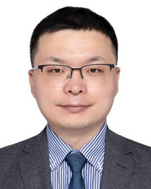

<!-- AUTO-GENERATED-BY: work/generate_obsidian_profiles.py -->

<!-- TEMPLATE: D:\workspace\信息收集整理\医生画像仓库\模板\医生画像模板.md -->

# 王亮

## 基础信息

| 字段 | 内容 |
|---|---|
| 姓名 | 王亮 |
| 医院 | 广东省人民医院 |
| 科室 | 检验科 |
| 职称/身份 | 教授/研究员 |
| 来源链接 | [官网原文](https://www.gdghospital.org.cn/Expertlistt/info_itemid_54389_subjectid_60.html) |
| 采集日期 | 2026-08-14 |

## 简介/擅长

## 教育与进修经历

- 博士研究生导师，博士后合作导师，入选广东省高层次人才计划，全球前2%顶尖科学家榜单，香港理工大学访问学者，昆士兰大学和西澳大学客座研究员，伊迪斯.科文大学客座教授，荣获美国化学会测量科学新星奖（2025）以及JoVE研究创新奖（2025）。
- 受邀在美国化学会年会，国际感染病学大会，国际生命科学、生物化学和生物信息学大会以及国际显微光谱大会等国际会议特邀报告、学术报告及担任分会场主席20余次，指导本科生和研究生荣获多项国家奖学金和优秀学位论文，并多次荣获“全国大学生生命科学竞赛”指导教师一等奖。

## 科研项目与成果

- 近5年主持科技部重大专项课题1项，国家高端外国专家引进计划1项，国家自然科学基金3项，省自然科学基金1项。
- 以第一作者或通讯作者在 The Lancet Microbe，npj Digital Medicine，Trends in Analytical Chemistry，Journal of Advanced Research等期刊发表SCI论文100余篇，主编《Python程序设计》(2026)和《系统生物学》(2022)等本科院校教材和中英文专著7部，参编国内外专家共识5项，获批发明专利和软件著作权20余项，研究成果被《中国日报》，《南华早报》，《中国科学报》等国内外媒体报道。
- 担任国家自然科学基金、欧洲科学基金会和英国创新研究基金会函评专家，牛津大学出版社Journal of Applied Microbiology主管编辑（健康和疾病方向），Journal of Translational Medicine 副主编（计算建模和流行病学），Frontiers in Microbiology杰出副主编（2022），BMC Microbiology杰出编委（2025），同时担任PeerJ，BMC Bioinformatics，International Journal of Microbi…

## 论文与学术产出

- 以第一作者或通讯作者在 The Lancet Microbe，npj Digital Medicine，Trends in Analytical Chemistry，Journal of Advanced Research等期刊发表SCI论文100余篇，主编《Python程序设计》(2026)和《系统生物学》(2022)等本科院校教材和中英文专著7部，参编国内外专家共识5项，获批发明专利和软件著作权20余项，研究成果被《中国日报》，《南华早报》，《中国科学报》等国内外媒体报道。
- 担任国家自然科学基金、欧洲科学基金会和英国创新研究基金会函评专家，牛津大学出版社Journal of Applied Microbiology主管编辑（健康和疾病方向），Journal of Translational Medicine 副主编（计算建模和流行病学），Frontiers in Microbiology杰出副主编（2022），BMC Microbiology杰出编委（2025），同时担任PeerJ，BMC Bioinformatics，International Journal of Microbi…
- 受邀在美国化学会年会，国际感染病学大会，国际生命科学、生物化学和生物信息学大会以及国际显微光谱大会等国际会议特邀报告、学术报告及担任分会场主席20余次，指导本科生和研究生荣获多项国家奖学金和优秀学位论文，并多次荣获“全国大学生生命科学竞赛”指导教师一等奖。

## 可包装亮点

- 博士研究生导师，博士后合作导师，入选广东省高层次人才计划，全球前2%顶尖科学家榜单，香港理工大学访问学者，昆士兰大学和西澳大学客座研究员，伊迪斯.科文大学客座教授，荣获美国化学会测量科学新星奖（2025）以及JoVE研究创新奖（2025）。
- 近5年主持科技部重大专项课题1项，国家高端外国专家引进计划1项，国家自然科学基金3项，省自然科学基金1项。
- 现任广东省医院协会微生物与临床感染专业委员会主任委员，中国人体健康科技促进会临床微生物与感染精准检验专委会副秘书长，中国中医药信息学会临床智慧医疗分会常委，广东省医学会微生态医学专委会常委以及广东省医师学会检验医师分会委员等职务。
- 以第一作者或通讯作者在 The Lancet Microbe，npj Digital Medicine，Trends in Analytical Chemistry，Journal of Advanced Research等期刊发表SCI论文100余篇...

## 重点疾病/人群标签

- 慢性病：
- 肿瘤：
- 生殖疾病：
- 免疫/风湿：
- 术后恢复/康复：
- 疑难重症：

## 证据摘录

> 只摘录官网公开信息中的短句或关键字段，不复制大段原文。

- 官网身份字段：教授/研究员
- 官网亮眼经历线索：博士研究生导师，博士后合作导师，入选广东省高层次人才计划，全球前2%顶尖科学家榜单，香港理工大学访问学者，昆士兰大学和西澳大学客座研究员，伊迪斯.科文大学客座教授，荣获美国化学会测量科学新星奖（2025）以及JoVE研究创新奖（2025）。 近5年主持科技部重大专项课题1项，国家高端外国专家引进计划1项，国家自然科学基金3项，省自然科学基金1项。 现任广东省医院协会微生物与临床感染专业委员会主任委员，中国人体健康科技促进会临床微生物与…
- 异常提示：同名待甄别
- 来源链接：https://www.gdghospital.org.cn/Expertlistt/info_itemid_54389_subjectid_60.html

## BD 画像摘要

王亮医生可作为广东省人民医院检验科的基础医生资料入库。当前重点方向以总底表标签为准，官网未展示的信息保持空白。

## 合规边界

- 仅使用医院官网、官方公众号、官方小程序等公开渠道。
- 不采集私人电话、私人微信、家庭住址、患者隐私或非公开排班信息。
- 不写“保证治愈”“疗效第一”“包治疑难杂症”等无法由官网证明的表述。
