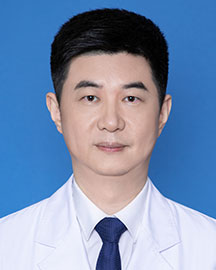

<!-- AUTO-GENERATED-BY: work/generate_obsidian_profiles.py -->

<!-- TEMPLATE: D:\workspace\信息收集整理\医生画像仓库\模板\医生画像模板.md -->

# 王坤

## 基础信息

| 字段 | 内容 |
|---|---|
| 姓名 | 王坤 |
| 医院 | 广东省人民医院 |
| 科室 | 乳腺肿瘤科 |
| 职称/身份 | 主任医师 科主任 |
| 来源链接 | [官网原文](https://www.gdghospital.org.cn/Expertlistt/info_itemid_25051_subjectid_30.html) |
| 采集日期 | 2026-08-14 |

## 简介/擅长

擅长乳腺肿块、钙化的良恶性鉴别

## 科研项目与成果

- 主持国家自然基金，广东省自然基金，澳门科学技术发展基金，广东省科 技计划及广东省科技重点研发计划等课题多项，获得省科技进步二等奖一项。
- 2021年NeoCART研 究成果被美国NCCN指南引用，这是中国第一个新辅助临床研究被美国NCCN乳腺 癌临床指南引用。
- 2.2023年获年度“我最喜爱的岭南大医生”奖项 3.2023年人民好医生-乳腺癌领域杰出贡献奖获得者 4.2023年获中国发明协会“发明创业奖项目奖”银奖。

## 论文与学术产出

- 以第 一作者或者通信作者在J Clin Oncol、Cell Rep Med、Radiology、Adv Sci、 EClinicalMedicine、EBioMedicine、Ann Surg、Br J Surg、Int J Surg、Clin Cancer Res、J Immunother Cancer、Exp Hematol Oncol、Eur J Cancer、Br J Cancer、Int J Cancer等国际权威杂志发表SCI文章80余篇。

## 可包装亮点

- 乳癌的精准保乳；
- 乳癌的化疗、靶向、内分泌治疗和免疫治疗等 多学科综合治疗。
- 简介 中山医科大学肿瘤学博士，博士生导师，广东省人民医院肿瘤医院副院长、 乳腺肿瘤科主任。
- 从医近30年，师从于全国著名肿瘤学专家吴一龙教授，2010年 由广东省人民医院公派去美国排名第一的纽约“纪念斯隆-凯特林癌症中 心”(MSKCC)乳腺中心学习乳腺癌保乳、Ⅰ期乳房再造技术及乳腺癌多学科综合治 疗等，致力于将美国先进的治疗技术和理念和中国的实际相结合，为乳腺肿瘤患者 提供最佳的个体化精准治疗和多学科综合治疗。

## 重点疾病/人群标签

- 慢性病：
- 肿瘤：肿瘤、癌、化疗、靶向、乳腺癌、免疫、多学科、MDT
- 生殖疾病：
- 免疫/风湿：肿瘤、癌、化疗、靶向、乳腺癌、免疫、多学科、MDT
- 术后恢复/康复：
- 疑难重症：肿瘤、癌、化疗、靶向、乳腺癌、免疫、多学科、MDT

## 证据摘录

> 只摘录官网公开信息中的短句或关键字段，不复制大段原文。

- 官网身份字段：主任医师 科主任
- 官网简介/擅长：擅长乳腺肿块、钙化的良恶性鉴别
- 官网亮眼经历线索：乳癌的精准保乳； 乳癌的化疗、靶向、内分泌治疗和免疫治疗等 多学科综合治疗。 简介 中山医科大学肿瘤学博士，博士生导师，广东省人民医院肿瘤医院副院长、 乳腺肿瘤科主任。 从医近30年，师从于全国著名肿瘤学专家吴一龙教授，2010年 由广东省人民医院公派去美国排名第一的纽约“纪念斯隆-凯特林癌症中 心”(MSKCC)乳腺中心学习乳腺癌保乳、Ⅰ期乳房再造技术及乳腺癌多学科综合治 疗等，致力于将美国先进的治疗技术和理念和中国的实际相结合，为…
- 来源链接：https://www.gdghospital.org.cn/Expertlistt/info_itemid_25051_subjectid_30.html

## BD 画像摘要

王坤医生可作为肿瘤、免疫/风湿/感染、疑难重症方向的基础画像候选。后续 BD 使用应继续以官网来源和人工复核为准，不添加疗效承诺或无来源包装。

## 合规边界

- 仅使用医院官网、官方公众号、官方小程序等公开渠道。
- 不采集私人电话、私人微信、家庭住址、患者隐私或非公开排班信息。
- 不写“保证治愈”“疗效第一”“包治疑难杂症”等无法由官网证明的表述。
