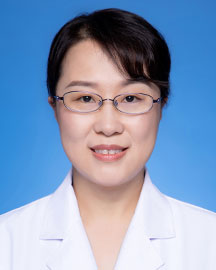

<!-- AUTO-GENERATED-BY: work/generate_obsidian_profiles.py -->

<!-- TEMPLATE: D:\workspace\信息收集整理\医生画像仓库\模板\医生画像模板.md -->

# 王晓茜

## 基础信息

| 字段 | 内容 |
|---|---|
| 姓名 | 王晓茜 |
| 医院 | 广东省人民医院 |
| 科室 | 耳科 |
| 职称/身份 | 副主任医师 |
| 来源链接 | [官网原文](https://www.gdghospital.org.cn/Expertlistt/info_itemid_24952_subjectid_109.html) |
| 采集日期 | 2026-08-14 |

## 简介/擅长

中耳炎、耳聋、耳畸形、面瘫、耳鸣、眩晕等耳科常见疾病的诊治

## 科研项目与成果

- 个人简介： 医学硕士 ，长期从事耳鼻咽喉科临床工作，具备扎实的理论基础和丰富的临床经验，熟练掌握本专业常见病、多发病以及部分疑难疾病的的诊断和治疗，主持和参与多项部级、省级课题，发表专业论文二十余篇。

## 论文与学术产出

- 个人简介： 医学硕士 ，长期从事耳鼻咽喉科临床工作，具备扎实的理论基础和丰富的临床经验，熟练掌握本专业常见病、多发病以及部分疑难疾病的的诊断和治疗，主持和参与多项部级、省级课题，发表专业论文二十余篇。

## 可包装亮点

- 个人简介： 医学硕士 ，长期从事耳鼻咽喉科临床工作，具备扎实的理论基础和丰富的临床经验，熟练掌握本专业常见病、多发病以及部分疑难疾病的的诊断和治疗，主持和参与多项部级、省级课题，发表专业论文二十余篇。
- 社会任职： 中国医疗保健促进会老年医学会 委员 中国医疗保健促进会耳内科分会青年委员会 委员 广东省医师协会耳鼻咽喉科分会耳科学组 委员

## 重点疾病/人群标签

- 慢性病：慢性、肿瘤、瘤、疑难
- 肿瘤：慢性、肿瘤、瘤、疑难
- 生殖疾病：
- 免疫/风湿：
- 术后恢复/康复：
- 疑难重症：慢性、肿瘤、瘤、疑难

## 证据摘录

> 只摘录官网公开信息中的短句或关键字段，不复制大段原文。

- 官网身份字段：副主任医师
- 官网简介/擅长：中耳炎、耳聋、耳畸形、面瘫、耳鸣、眩晕等耳科常见疾病的诊治
- 官网亮眼经历线索：个人简介： 医学硕士 ，长期从事耳鼻咽喉科临床工作，具备扎实的理论基础和丰富的临床经验，熟练掌握本专业常见病、多发病以及部分疑难疾病的的诊断和治疗，主持和参与多项部级、省级课题，发表专业论文二十余篇。 社会任职： 中国医疗保健促进会老年医学会 委员 中国医疗保健促进会耳内科分会青年委员会 委员 广东省医师协会耳鼻咽喉科分会耳科学组 委员
- 来源链接：https://www.gdghospital.org.cn/Expertlistt/info_itemid_24952_subjectid_109.html

## BD 画像摘要

王晓茜医生可作为慢性病、肿瘤、疑难重症方向的基础画像候选。后续 BD 使用应继续以官网来源和人工复核为准，不添加疗效承诺或无来源包装。

## 合规边界

- 仅使用医院官网、官方公众号、官方小程序等公开渠道。
- 不采集私人电话、私人微信、家庭住址、患者隐私或非公开排班信息。
- 不写“保证治愈”“疗效第一”“包治疑难杂症”等无法由官网证明的表述。
